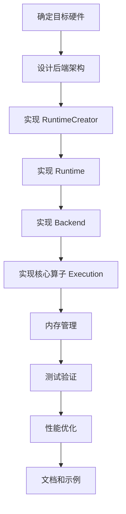

# MNN 后端开发指南

本文档详细说明如何在 MNN 中添加新的硬件后端支持。

## 目录
1. [后端架构概述](#后端架构概述)
2. [开发流程](#开发流程)
3. [详细步骤](#详细步骤)
4. [示例：Dummy 后端](#示例dummy-后端)
5. [性能优化](#性能优化)
6. [测试和验证](#测试和验证)
7. [最佳实践](#最佳实践)

## 后端架构概述

### 三层抽象

MNN 的后端采用三层抽象设计：

```
RuntimeCreator (工厂)
    ↓
Runtime (运行时管理)
    ↓
Backend (后端实例)
    ↓
Execution (算子执行器)
```

### 关键组件

| 组件 | 职责 | 生命周期 |
|------|------|---------|
| **RuntimeCreator** | 创建 Runtime 实例 | 全局单例 |
| **Runtime** | 管理后端资源和配置 | 跨 Session 共享 |
| **Backend** | 创建 Execution，管理内存 | 每个 Session 一个 |
| **Execution** | 实现具体算子计算 | 每个算子一个 |

### 编译器类型

```cpp
enum CompilerType {
    Compiler_Geometry = 0,  // 使用几何分解（默认）
    Compiler_Origin = 1,    // 直接使用原始算子
    Compiler_Loop = 2,      // 使用循环优化
};
```

- **Compiler_Geometry**: 适用于不原生支持所有算子的后端，通过几何分解将复杂算子拆解为简单算子
- **Compiler_Origin**: 适用于 GPU 等后端，直接使用原始算子，不进行分解
- **Compiler_Loop**: 适用于 CPU 后端，使用循环优化

## 开发流程



## 详细步骤

### 步骤 1: 定义后端类型

在 `include/MNN/MNNForwardType.h` 中添加新的后端类型：

```cpp
typedef enum {
    MNN_FORWARD_CPU = 0,
    MNN_FORWARD_METAL = 1,
    MNN_FORWARD_CUDA = 2,
    MNN_FORWARD_OPENCL = 3,
    // ... 其他后端 ...
    MNN_FORWARD_MY_BACKEND = 20,  // 选择未使用的编号
    MNN_FORWARD_AUTO = 4,
    MNN_FORWARD_USER_0 = 100,
    MNN_FORWARD_USER_1 = 101,
    // ...
} MNNForwardType;
```

### 步骤 2: 创建目录结构

在 `source/backend/` 下创建新后端目录：

```
source/backend/mybackend/
├── MyBackendBackend.hpp
├── MyBackendBackend.cpp
├── MyBackendRuntime.hpp
├── MyBackendRuntime.cpp
├── execution/
│   ├── MyBackendConvolution.hpp
│   ├── MyBackendConvolution.cpp
│   ├── MyBackendPooling.hpp
│   └── MyBackendPooling.cpp
└── CMakeLists.txt
```

### 步骤 3: 实现 Runtime

Runtime 负责管理后端的全局资源，如设备上下文、命令队列等。

#### 关键方法

- `onCreate()`: 创建 Backend 实例
- `onGabageCollect()`: 垃圾回收
- `onGetCompilerType()`: 返回编译器类型
- `onSetCache()` / `onGetCache()`: 缓存管理

### 步骤 4: 实现 Backend

Backend 负责创建算子执行器和管理内存。

#### 关键方法

- `onCreate()`: 根据算子类型创建 Execution
- `onAcquire()`: 分配设备内存
- `onClearBuffer()`: 清理内存
- `onCopyBuffer()`: Host-Device 数据拷贝
- `onExecuteBegin()` / `onExecuteEnd()`: 执行前后的回调

### 步骤 5: 实现 Execution

Execution 实现具体算子的计算逻辑。

#### 关键方法

- `onResize()`: 根据输入形状调整资源
- `onExecute()`: 执行算子计算

### 步骤 6: 实现 RuntimeCreator

RuntimeCreator 是工厂类，负责创建 Runtime 实例并注册到 MNN。

```cpp
class MyBackendRuntimeCreator : public RuntimeCreator {
public:
    virtual Runtime* onCreate(const Backend::Info& info) const override {
        return new MyBackendRuntime(info);
    }
};

// 注册
static bool gInit = []() {
    MNNInsertExtraRuntimeCreator(MNN_FORWARD_MY_BACKEND, 
                                 new MyBackendRuntimeCreator, true);
    return true;
}();
```

### 步骤 7: 配置 CMake

创建 `CMakeLists.txt` 并在根 CMakeLists.txt 中添加选项。

## 示例：Dummy 后端

完整的最小化示例，实现一个什么都不做的 Dummy 后端：

```cpp
// DummyBackend.cpp
#include "core/Backend.hpp"
#include "core/Execution.hpp"

namespace MNN {

// 1. Execution 实现
class DummyExecution : public Execution {
public:
    DummyExecution(Backend* backend) : Execution(backend) {}
    
    virtual ErrorCode onExecute(const std::vector<Tensor*>&,
                               const std::vector<Tensor*>&) override {
        // 什么都不做，直接返回成功
        return NO_ERROR;
    }
};

// 2. Backend 实现
class DummyBackend : public Backend {
public:
    DummyBackend() : Backend(MNN_FORWARD_USER_0) {}
    
    virtual Execution* onCreate(const std::vector<Tensor*>&,
                               const std::vector<Tensor*>&,
                               const Op*) override {
        // 所有算子都返回 DummyExecution
        return new DummyExecution(this);
    }
    
    virtual void onExecuteBegin() const override {}
    virtual void onExecuteEnd() const override {}
    virtual ErrorCode onResizeEnd() override { return NO_ERROR; }
    
    virtual MemObj* onAcquire(const Tensor*, StorageType) override {
        // 不分配实际内存
        return nullptr;
    }
    
    virtual bool onClearBuffer() override { return true; }
    
    virtual void onCopyBuffer(const Tensor*, const Tensor*) const override {}
};

// 3. Runtime 实现
class DummyRuntime : public Runtime {
public:
    virtual Backend* onCreate(const BackendConfig*, Backend*) const override {
        return new DummyBackend();
    }
    
    virtual void onGabageCollect(int) override {}
};

// 4. RuntimeCreator 实现和注册
class DummyRuntimeCreator : public RuntimeCreator {
public:
    virtual Runtime* onCreate(const Backend::Info&) const override {
        return new DummyRuntime();
    }
};

static bool gInit = []() {
    MNNInsertExtraRuntimeCreator(MNN_FORWARD_USER_0, 
                                 new DummyRuntimeCreator, true);
    return true;
}();

} // namespace MNN
```

使用 Dummy 后端：

```cpp
#include <MNN/Interpreter.hpp>

// 创建配置
ScheduleConfig config;
config.type = MNN_FORWARD_USER_0;  // 使用 Dummy 后端

// 加载模型
auto net = Interpreter::createFromFile("model.mnn");
auto session = net->createSession(config);

// 运行推理
net->runSession(session);
```

## 性能优化

### 1. 内存优化

**使用内存池**：
```cpp
class MyBackendBackend : public Backend {
private:
    std::shared_ptr<BufferAllocator> mStaticAllocator;
    std::shared_ptr<BufferAllocator> mDynamicAllocator;
    
public:
    MyBackendBackend() {
        mStaticAllocator.reset(new EagerBufferAllocator());
        mDynamicAllocator.reset(new EagerBufferAllocator());
    }
};
```

**复用临时缓冲区**：
```cpp
// 在 Execution 中缓存临时缓冲区
class MyExecution : public Execution {
private:
    void* mTempBuffer = nullptr;
    size_t mTempBufferSize = 0;
    
public:
    ErrorCode onResize(...) override {
        size_t requiredSize = calculateTempBufferSize();
        if (requiredSize > mTempBufferSize) {
            // 重新分配
            freeTempBuffer();
            mTempBuffer = allocTempBuffer(requiredSize);
            mTempBufferSize = requiredSize;
        }
        return NO_ERROR;
    }
};
```

### 2. 计算优化

**批处理操作**：
```cpp
// 合并多个小操作为一个大操作
void batchExecute(const std::vector<Command>& commands) {
    // 收集所有命令
    // 一次性提交到设备
}
```

**异步执行**：
```cpp
void onExecuteBegin() const override {
    // 创建命令缓冲，但不立即执行
    mCommandBuffer = createCommandBuffer();
}

void onExecuteEnd() const override {
    // 提交所有命令并异步执行
    submitCommandBuffer(mCommandBuffer);
    // 可选：等待完成
    waitCommandBuffer(mCommandBuffer);
}
```

### 3. 数据传输优化

**减少 Host-Device 拷贝**：
```cpp
// 尽量在设备上完成所有计算
// 只在必要时才拷贝数据
void onCopyBuffer(const Tensor* src, const Tensor* dst) const override {
    if (src->deviceId() != 0 && dst->deviceId() != 0) {
        // Device to Device，直接在设备上拷贝
        deviceCopy(src->deviceId(), dst->deviceId(), src->size());
    } else {
        // Host-Device 拷贝
        // ...
    }
}
```

**使用 Pinned Memory**：
```cpp
// 使用页锁定内存加速 Host-Device 传输
void* allocPinnedMemory(size_t size) {
    // 平台相关的 pinned memory 分配
}
```

## 测试和验证

### 单元测试

```cpp
// test/backend/MyBackendTest.cpp
#include "MNNTestSuite.h"
#include <MNN/Interpreter.hpp>

class MyBackendTest : public MNNTestCase {
public:
    virtual bool run(int precision) {
        // 创建配置
        ScheduleConfig config;
        config.type = MNN_FORWARD_MY_BACKEND;
        
        // 加载模型
        auto net = Interpreter::createFromFile("model.mnn");
        if (net == nullptr) {
            MNN_ERROR("Failed to load model\n");
            return false;
        }
        
        auto session = net->createSession(config);
        if (session == nullptr) {
            MNN_ERROR("Failed to create session\n");
            return false;
        }
        
        // 准备输入
        auto input = net->getSessionInput(session, nullptr);
        auto inputPtr = input->host<float>();
        for (int i = 0; i < input->elementSize(); ++i) {
            inputPtr[i] = i * 0.1f;
        }
        
        // 运行推理
        auto ret = net->runSession(session);
        if (ret != NO_ERROR) {
            MNN_ERROR("Failed to run session\n");
            return false;
        }
        
        // 验证输出
        auto output = net->getSessionOutput(session, nullptr);
        auto outputPtr = output->readMap<float>();
        // 验证结果...
        
        return true;
    }
};

MNNTestSuiteRegister(MyBackendTest, "backend/mybackend");
```

### 性能测试

```bash
# 编译
mkdir build && cd build
cmake .. -DMNN_MYBACKEND=ON
make -j$(nproc)

# 运行性能测试
./benchmark.out --backend MyBackend --model model.mnn
```

### 正确性验证

```cpp
// 对比 CPU 和自定义后端的输出
bool compareWithCPU(const char* modelPath) {
    // CPU 后端
    ScheduleConfig cpuConfig;
    cpuConfig.type = MNN_FORWARD_CPU;
    auto cpuNet = Interpreter::createFromFile(modelPath);
    auto cpuSession = cpuNet->createSession(cpuConfig);
    
    // 自定义后端
    ScheduleConfig myConfig;
    myConfig.type = MNN_FORWARD_MY_BACKEND;
    auto myNet = Interpreter::createFromFile(modelPath);
    auto mySession = myNet->createSession(myConfig);
    
    // 相同输入
    auto cpuInput = cpuNet->getSessionInput(cpuSession, nullptr);
    auto myInput = myNet->getSessionInput(mySession, nullptr);
    // 填充相同数据...
    
    // 运行
    cpuNet->runSession(cpuSession);
    myNet->runSession(mySession);
    
    // 对比输出
    auto cpuOutput = cpuNet->getSessionOutput(cpuSession, nullptr);
    auto myOutput = myNet->getSessionOutput(mySession, nullptr);
    
    return compareOutputs(cpuOutput, myOutput, 1e-3f);
}
```

## 最佳实践

### 1. 错误处理

```cpp
ErrorCode onExecute(...) override {
    // 检查输入
    if (inputs.empty() || outputs.empty()) {
        MNN_ERROR("Invalid inputs or outputs\n");
        return INPUT_DATA_ERROR;
    }
    
    // 执行计算
    auto ret = deviceCompute(...);
    if (ret != SUCCESS) {
        MNN_ERROR("Device compute failed: %d\n", ret);
        return COMPUTE_SIZE_ERROR;
    }
    
    return NO_ERROR;
}
```

### 2. 资源管理

```cpp
class MyBackendBackend : public Backend {
public:
    ~MyBackendBackend() {
        // 清理所有资源
        onClearBuffer();
        destroyDevice();
    }
    
private:
    void destroyDevice() {
        if (mDevice) {
            deviceDestroy(mDevice);
            mDevice = nullptr;
        }
    }
};
```

### 3. 线程安全

```cpp
class MyBackendRuntime : public Runtime {
private:
    std::mutex mMutex;
    
public:
    Backend* onCreate(...) const override {
        std::lock_guard<std::mutex> lock(mMutex);
        // 创建 Backend
        return new MyBackendBackend(this);
    }
};
```

### 4. 调试支持

```cpp
#ifdef MNN_DEBUG
    #define MY_BACKEND_PRINT(...) MNN_PRINT(__VA_ARGS__)
#else
    #define MY_BACKEND_PRINT(...)
#endif

ErrorCode onExecute(...) override {
    MY_BACKEND_PRINT("Executing op: %s\n", op->name()->c_str());
    MY_BACKEND_PRINT("Input shape: %d x %d x %d x %d\n",
                     input->batch(), input->channel(),
                     input->height(), input->width());
    
    // 执行计算
    auto ret = deviceCompute(...);
    
    MY_BACKEND_PRINT("Execution result: %d\n", ret);
    return ret;
}
```

## 常见问题

### Q1: 如何处理不支持的算子？

在 `Backend::onCreate()` 中返回 `nullptr`，MNN 会自动 fallback 到 CPU 后端：

```cpp
Execution* onCreate(...) override {
    switch (op->type()) {
        case OpType_Convolution:
            return new MyConvolution(this, op);
        case OpType_Pooling:
            return new MyPooling(this, op);
        default:
            // 不支持的算子，fallback 到 CPU
            return nullptr;
    }
}
```

### Q2: 如何优化内存使用？

- 实现高效的内存分配器
- 复用内存块
- 使用内存池

### Q3: 如何支持多设备？

在 Runtime 中管理多个设备实例：

```cpp
class MyBackendRuntime : public Runtime {
private:
    std::vector<void*> mDevices;
    int mCurrentDevice = 0;
    
public:
    MyBackendRuntime(const Backend::Info& info) {
        int deviceCount = getDeviceCount();
        for (int i = 0; i < deviceCount; ++i) {
            mDevices.push_back(createDevice(i));
        }
    }
    
    void* getDevice(int index) const {
        return mDevices[index];
    }
};
```

### Q4: 如何调试后端？

- 使用 `MNN_PRINT` 打印调试信息
- 对比 CPU 后端的输出
- 使用硬件厂商提供的调试工具

## 参考资源

- [现有后端实现](../../source/backend/)
  - CPU: `source/backend/cpu/`
  - Metal: `source/backend/metal/`
  - CUDA: `source/backend/cuda/`
  - OpenCL: `source/backend/opencl/`
- [Backend 接口](../../source/core/Backend.hpp)
- [Runtime 接口](../../source/core/Runtime.hpp)
- [Execution 接口](../../source/core/Execution.hpp)
- [架构文档](./MNN_architecture.md)
- [类图](./MNN-Class-Diagrams.md)
