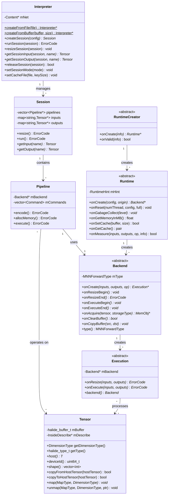
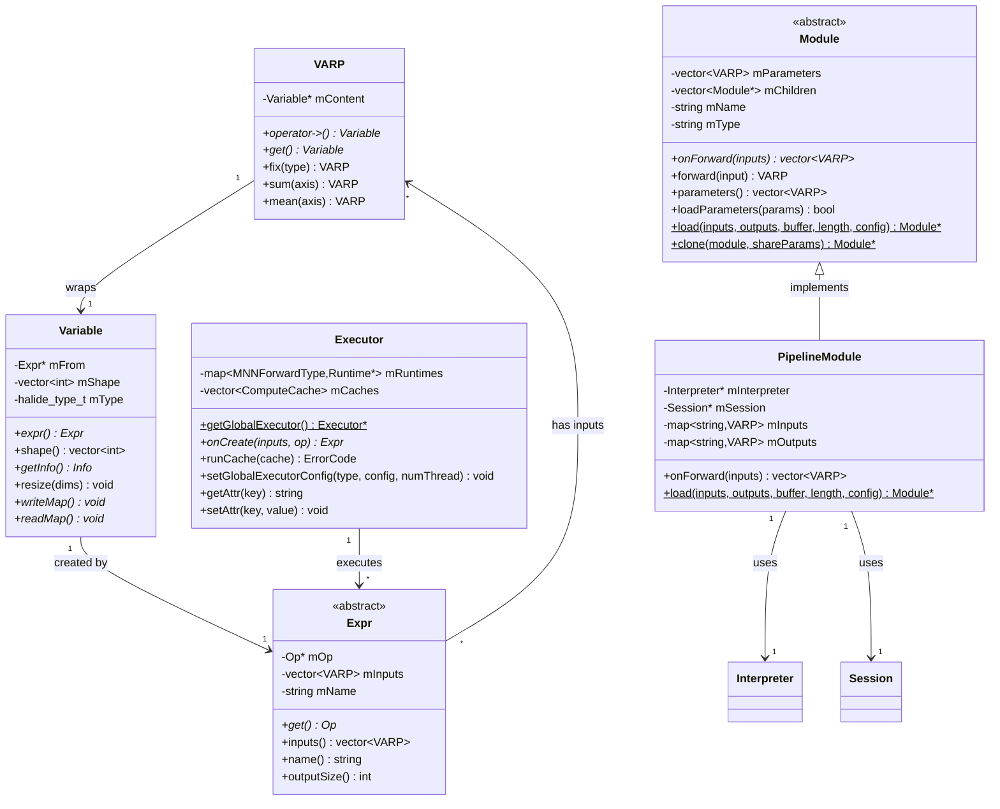
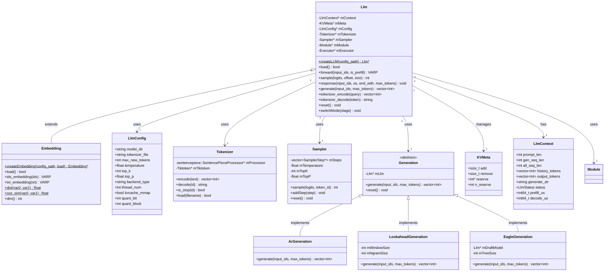
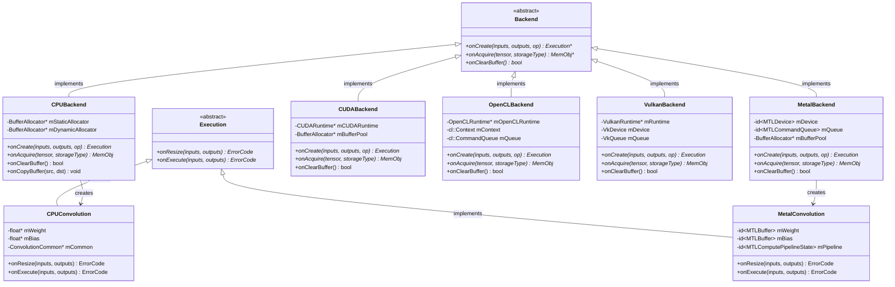

# MNN 核心类图

本文档使用 Mermaid 图表展示 MNN 核心类的结构和关系。

## 1. 核心推理类图

## 2. Express API 类图

## 3. LLM 子系统类图

## 4. 后端实现类图

## 类图说明

### 1. 核心推理类图
展示了 MNN 的核心推理架构，包括：
- **Interpreter**: 模型加载和会话管理的入口
- **Session**: 推理会话，管理多个 Pipeline
- **Pipeline**: 单个后端的执行流水线
- **Backend/Runtime**: 硬件后端抽象
- **Execution**: 单个算子的执行器
- **Tensor**: 数据容器

### 2. Express API 类图
展示了高级动态图 API：
- **VARP**: 智能指针，包装 Variable
- **Variable**: 变量，持有 Expr
- **Expr**: 表达式，表示计算图节点
- **Executor**: 全局执行器
- **Module**: 模型抽象，PipelineModule 是主要实现

### 3. LLM 子系统类图
展示了 LLM 推理引擎：
- **Llm**: 基类，提供核心推理能力
- **Embedding**: 句子嵌入特化
- **Tokenizer**: 分词器
- **Sampler**: 采样器
- **Generation**: 生成策略（AR/Lookahead/EAGLE）
- **KVMeta/LlmContext**: 运行时状态

### 4. 后端实现类图
展示了不同硬件后端的实现：
- 各后端继承 Backend 抽象类
- 每个后端创建对应的 Execution 实现
- 统一的接口，不同的实现
