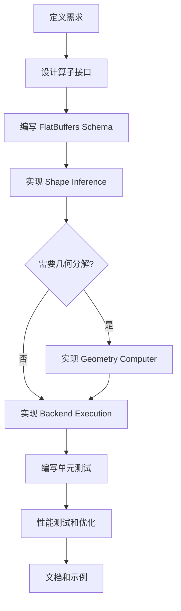

# MNN 算子开发指南

本文档详细说明如何在 MNN 中添加新的算子（Operator）。

> **注意**：本文档是面向人类开发者的详细教程。如果你是 AI Agent，请参考 `skills/add-new-op/SKILL.md`。

## 目录
1. [算子开发概述](#算子开发概述)
2. [开发流程](#开发流程)
3. [详细步骤](#详细步骤)
4. [示例：添加自定义算子](#示例添加自定义算子)
5. [测试和验证](#测试和验证)
6. [最佳实践](#最佳实践)

## 算子开发概述

### 算子注册模式

MNN 的算子实现遵循统一的四步注册模式：

```
1. Schema 定义 (schema/default/*.fbs)
   ↓
2. Shape Inference (source/shape/)
   ↓
3. Geometry 分解 [可选] (source/geometry/)
   ↓
4. Backend Execution 实现 (source/backend/*)
```

### 关键组件

| 组件 | 职责 | 位置 |
|------|------|------|
| **Schema** | 定义算子参数结构 | `schema/default/*.fbs` |
| **SizeComputer** | 计算输出张量形状 | `source/shape/` |
| **GeometryComputer** | 将复杂算子分解为简单算子 | `source/geometry/` |
| **Execution** | 实现具体的计算逻辑 | `source/backend/*/` |

### 优先级原则

**几何计算 > 后端实现**

- 如果算子可以通过已有算子组合实现，优先使用几何计算
- 只有在无法分解或性能关键时才实现后端

## 开发流程



## 详细步骤

### 步骤 1: 定义 FlatBuffers Schema

在 `schema/default/` 目录下定义算子的参数结构。

#### 1.1 添加 OpType

编辑 `schema/default/MNN.fbs`，在 `OpType` 枚举中添加新算子类型：

```flatbuffers
enum OpType : int {
    // ... 现有算子 ...
    MyCustomOp = 999,  // 选择一个未使用的编号
}
```

#### 1.2 定义参数表

在 `schema/default/` 下创建新文件（如 `MyCustomOp.fbs`）或使用现有文件：

```flatbuffers
namespace MNN;

table MyCustomOpParam {
    // 算子参数
    kernel_size: int = 3;
    stride: int = 1;
    padding: int = 0;
    activation: string;
    weights: [float];
}
```

#### 1.3 关联到 OpParameter

编辑 `schema/default/MNN.fbs`，在 `OpParameter` 联合体中添加：

```flatbuffers
union OpParameter {
    // ... 现有参数 ...
    MyCustomOpParam,
}
```

#### 1.4 重新生成代码

```bash
cd schema/default
./generate.sh  # 或在 Windows 上运行 generate.bat
```

这会生成 C++ 头文件到 `schema/default/` 目录。

### 步骤 2: 实现 Shape Inference

在 `source/shape/` 目录下创建 `ShapeMyCustomOp.cpp`：

```cpp
#include "shape/SizeComputer.hpp"
#include "core/Macro.h"

namespace MNN {

class MyCustomOpSizeComputer : public SizeComputer {
public:
    virtual bool onComputeSize(const MNN::Op* op, 
                               const std::vector<Tensor*>& inputs,
                               const std::vector<Tensor*>& outputs) const override {
        MNN_ASSERT(inputs.size() == 1);
        MNN_ASSERT(outputs.size() == 1);
        
        auto input = inputs[0];
        auto output = outputs[0];
        auto param = op->main_as_MyCustomOpParam();
        
        // 计算输出形状
        int batch = input->batch();
        int channel = input->channel();
        int height = input->height();
        int width = input->width();
        
        // 根据参数计算输出尺寸
        int kernel = param->kernel_size();
        int stride = param->stride();
        int padding = param->padding();
        
        int out_height = (height + 2 * padding - kernel) / stride + 1;
        int out_width = (width + 2 * padding - kernel) / stride + 1;
        
        // 设置输出形状
        output->buffer().dim[0].extent = batch;
        output->buffer().dim[1].extent = channel;
        output->buffer().dim[2].extent = out_height;
        output->buffer().dim[3].extent = out_width;
        
        // 设置数据类型
        output->buffer().type = input->buffer().type;
        
        return true;
    }
};

// 注册 SizeComputer
REGISTER_SHAPE(MyCustomOpSizeComputer, OpType_MyCustomOp);

} // namespace MNN
```

#### Shape Inference 关键点

1. **验证输入输出数量**：使用 `MNN_ASSERT` 检查
2. **计算输出形状**：根据输入形状和算子参数
3. **设置输出属性**：形状、数据类型、维度类型
4. **返回值**：成功返回 `true`，失败返回 `false`

### 步骤 3: 实现 Geometry Computer（可选）

如果算子可以分解为更简单的算子，在 `source/geometry/` 下创建 `GeometryMyCustomOp.cpp`：

```cpp
#include "geometry/GeometryComputer.hpp"
#include "core/OpCommonUtils.hpp"

namespace MNN {

class GeometryMyCustomOp : public GeometryComputer {
public:
    virtual bool onCompute(const Op* op, 
                          const std::vector<Tensor*>& inputs,
                          const std::vector<Tensor*>& outputs, 
                          Context& context,
                          CommandBuffer& res) const override {
        auto param = op->main_as_MyCustomOpParam();
        
        // 将 MyCustomOp 分解为基础算子
        // 例如：分解为 Conv2D + ReLU
        
        // 1. 创建中间张量
        std::shared_ptr<Tensor> temp(new Tensor);
        temp->buffer().dimensions = 4;
        // ... 设置中间张量属性
        
        // 2. 创建 Conv2D 算子
        {
            std::unique_ptr<OpT> convOp(new OpT);
            convOp->type = OpType_Convolution;
            // ... 设置卷积参数
            
            flatbuffers::FlatBufferBuilder builder;
            auto offset = Op::Pack(builder, convOp.get());
            builder.Finish(offset);
            Command cmd;
            cmd.op = flatbuffers::GetRoot<Op>(builder.GetBufferPointer());
            cmd.inputs = {inputs[0]};
            cmd.outputs = {temp.get()};
            res.command.emplace_back(std::move(cmd));
        }
        
        // 3. 创建 ReLU 算子
        {
            std::unique_ptr<OpT> reluOp(new OpT);
            reluOp->type = OpType_ReLU;
            
            flatbuffers::FlatBufferBuilder builder;
            auto offset = Op::Pack(builder, reluOp.get());
            builder.Finish(offset);
            Command cmd;
            cmd.op = flatbuffers::GetRoot<Op>(builder.GetBufferPointer());
            cmd.inputs = {temp.get()};
            cmd.outputs = {outputs[0]};
            res.command.emplace_back(std::move(cmd));
        }
        
        return true;
    }
};

// 注册 GeometryComputer
REGISTER_GEOMETRY(GeometryMyCustomOp, OpType_MyCustomOp);

} // namespace MNN
```

### 步骤 4: 实现 Backend Execution

为每个目标后端实现算子。以 CPU 后端为例：

#### 4.1 创建 Execution 类

在 `source/backend/cpu/` 下创建 `CPUMyCustomOp.hpp` 和 `CPUMyCustomOp.cpp`。

完整代码示例请参考现有算子实现，如 `CPUConvolution.cpp`。

### 步骤 5: 编写单元测试

在 `test/op/` 下创建测试文件，验证算子的正确性。

### 步骤 6: 运行注册脚本

```bash
python tools/script/register.py
```

这会自动注册新添加的 Shape、Geometry 和 Backend 实现。

## 示例：添加 ScaleAdd 算子

完整示例请参考 `skills/add-new-op/SKILL.md` 中的分步指南。

## 测试和验证

### 单元测试

```bash
cd build
./run_test.out MyCustomOpTest
```

### 性能测试

```bash
./benchmark.out --op MyCustomOp
```

## 最佳实践

### 1. 代码规范

- 遵循 MNN 的代码风格（Google Style）
- 使用 `clang-format` 格式化代码
- 添加必要的注释和文档

### 2. 性能优化

- **优先级**：正确性 > 可读性 > 性能
- 先实现正确的版本，再优化
- 使用 SIMD 指令（NEON/SSE/AVX）
- 考虑多线程并行

### 3. 内存管理

- 避免在 `onExecute` 中分配内存
- 在 `onResize` 中预分配所需内存
- 使用 MNN 的内存分配器

### 4. 错误处理

- 使用 `MNN_ASSERT` 检查前置条件
- 返回适当的 `ErrorCode`
- 添加有意义的错误日志

## 常见问题

### Q1: 如何调试算子？

使用 `MNN_PRINT` 打印调试信息：

```cpp
MNN_PRINT("Input shape: %d x %d x %d x %d\n", 
          input->batch(), input->channel(), 
          input->height(), input->width());
```

### Q2: 如何处理不同的数据类型？

```cpp
auto type = input->getType();
if (type.code == halide_type_float) {
    // FP32 处理
} else if (type.code == halide_type_int && type.bits == 8) {
    // INT8 处理
}
```

### Q3: 如何支持动态形状？

在 `onResize` 中根据输入形状重新计算和分配资源。

## 参考资源

- [MNN 官方文档](https://www.yuque.com/mnn/cn)
- [FlatBuffers 文档](https://google.github.io/flatbuffers/)
- [AI Agent 执行指南](../../skills/add-new-op/SKILL.md)
- [现有算子实现](../../source/backend/cpu/)
- [测试用例](../../test/op/)

## 受限访问

以下目录包含内部专有代码，**禁止访问**：
- `schema/private/`
- `source/internal/`
