# MNN 推理流程时序图

本文档使用 Mermaid 时序图展示 MNN 的关键执行流程。

## 1. Session API 推理流程

### 1.1 模型加载和会话创建

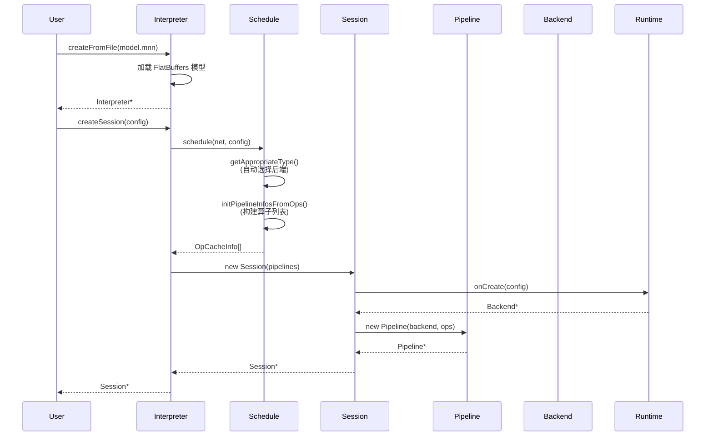

### 1.2 Resize 和内存分配

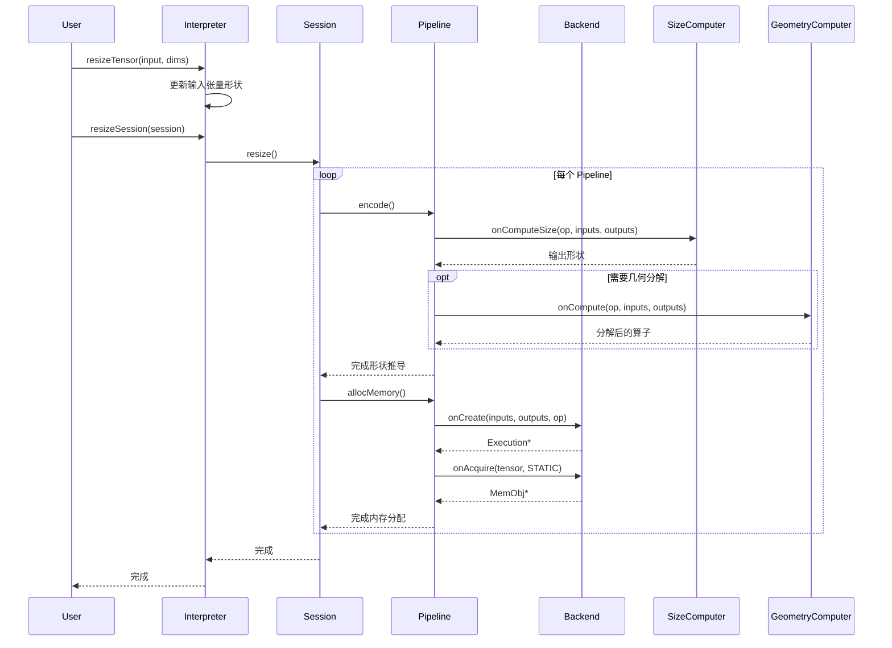

### 1.3 推理执行

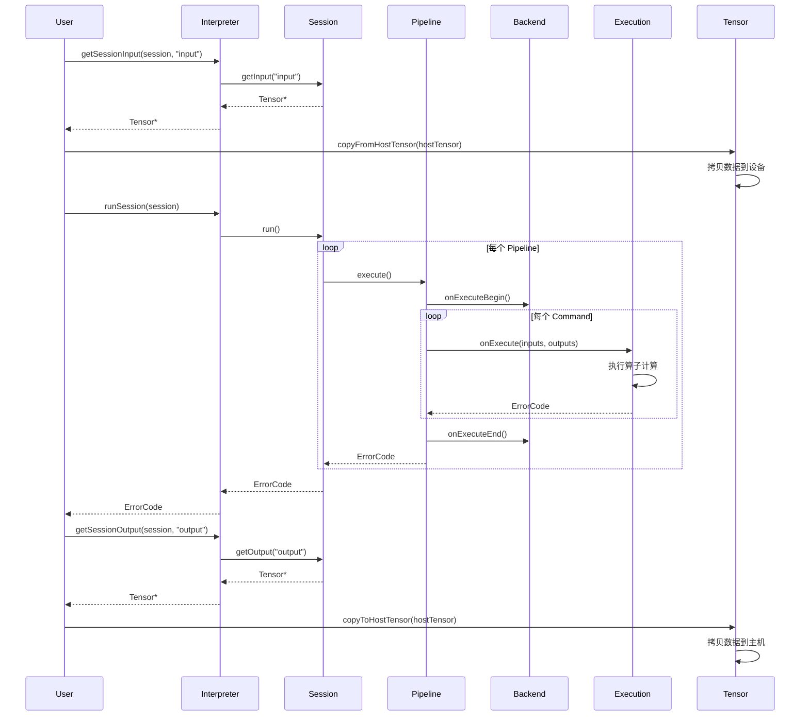

## 2. Module API 推理流程

### 2.1 模型加载

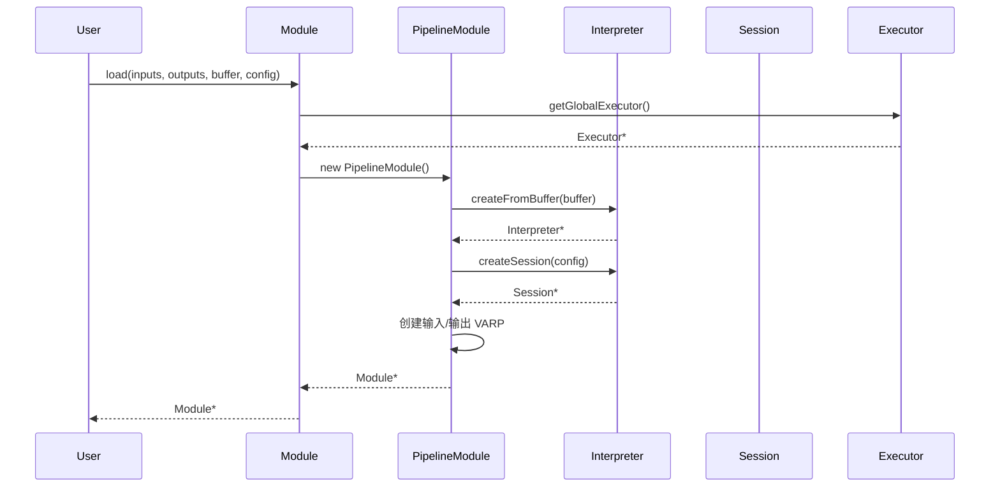

### 2.2 前向传播

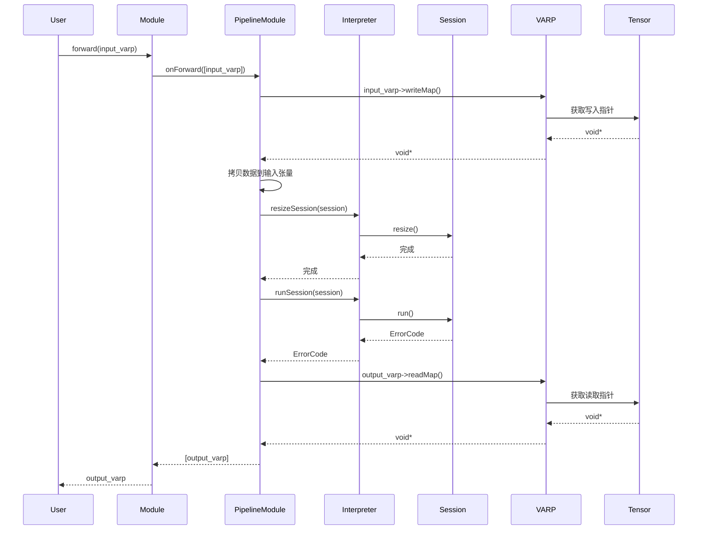

## 3. LLM 推理流程

### 3.1 LLM 初始化

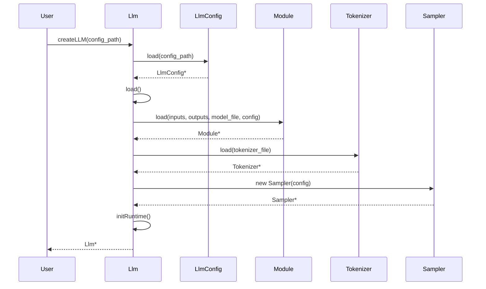

### 3.2 文本生成流程（Prefill + Decode）

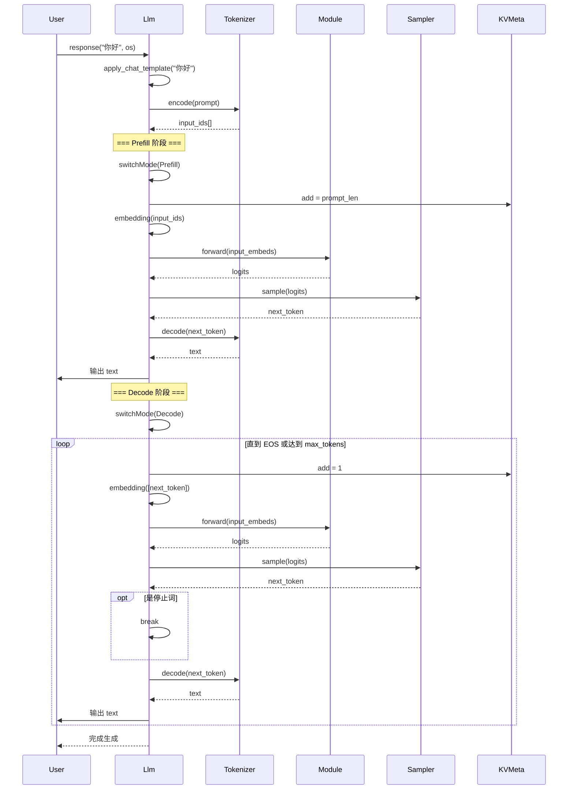

### 3.3 推测解码流程（EAGLE）

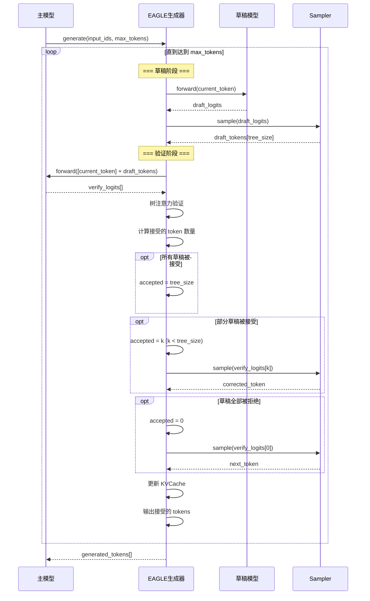

## 4. 后端算子执行流程

### 4.1 CPU 后端卷积执行

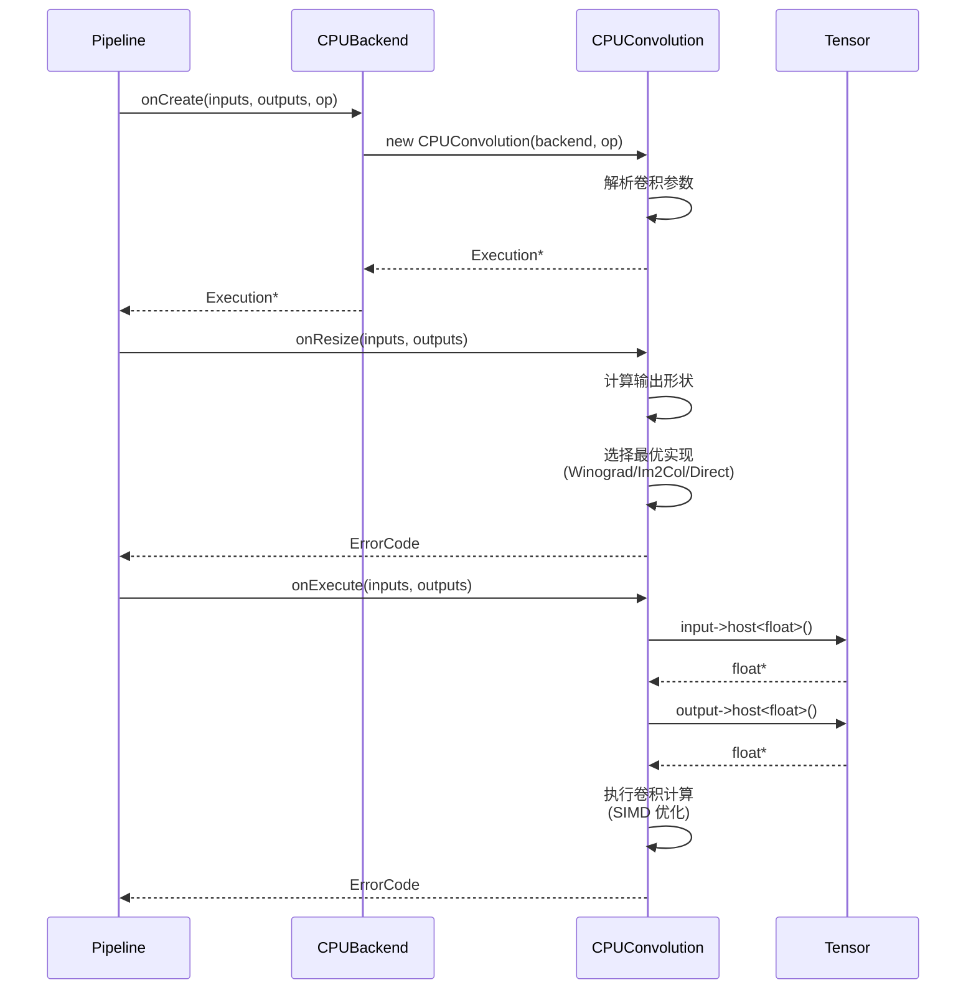

### 4.2 GPU 后端卷积执行（Metal）

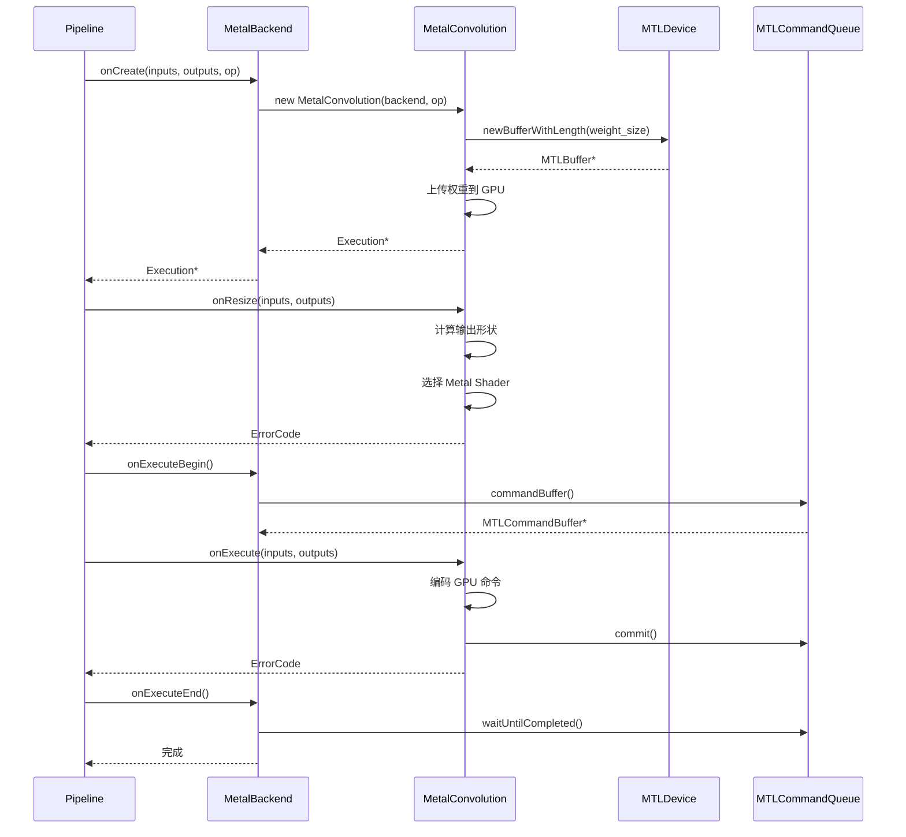

## 5. 内存管理流程

### 5.1 动态内存分配和复用

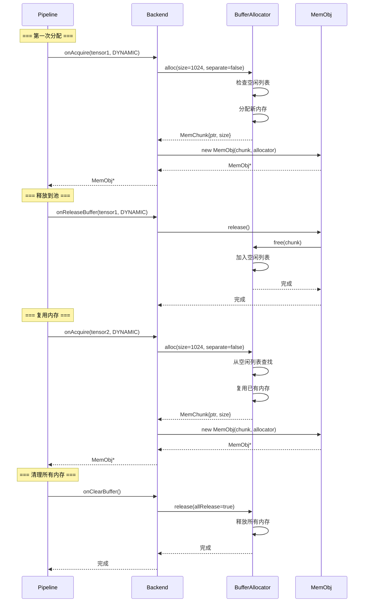

## 时序图说明

### 1. Session API 推理流程
展示了低级 API 的完整流程：
- **模型加载**：从文件加载 FlatBuffers 模型
- **会话创建**：自动选择后端，构建执行计划
- **Resize**：形状推导和内存分配
- **执行**：算子逐个执行

### 2. Module API 推理流程
展示了高级 API 的使用：
- **模型加载**：通过 Module 接口加载
- **前向传播**：使用 VARP 进行计算

### 3. LLM 推理流程
展示了 LLM 特有的流程：
- **初始化**：加载模型、分词器、采样器
- **Prefill + Decode**：两阶段生成
- **推测解码**：EAGLE 加速策略

### 4. 后端算子执行
展示了不同后端的执行差异：
- **CPU**：同步执行，直接计算
- **GPU**：异步执行，命令队列

### 5. 内存管理
展示了动态内存的分配和复用机制，提高内存利用率。
