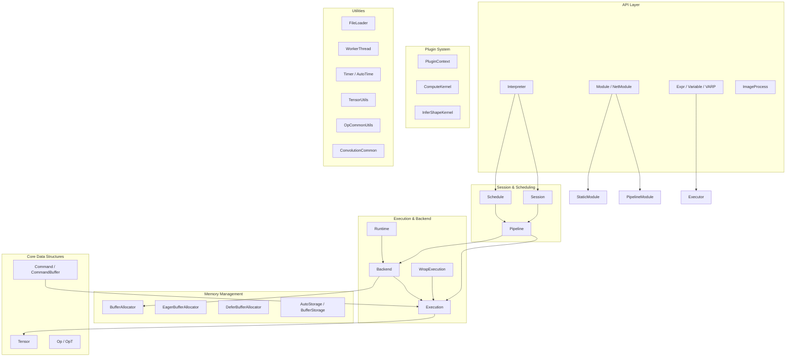
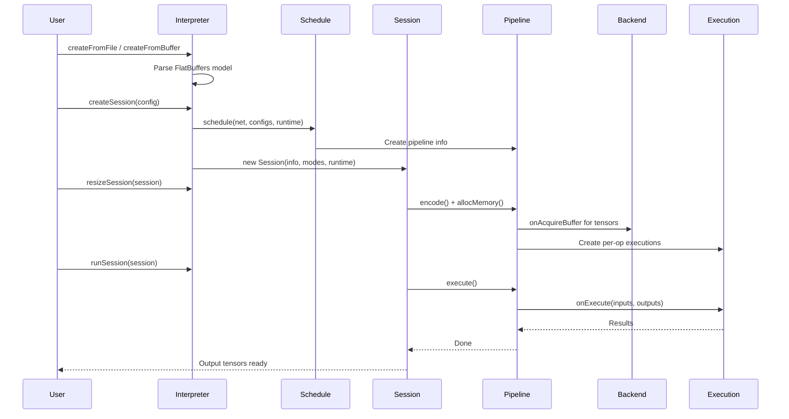
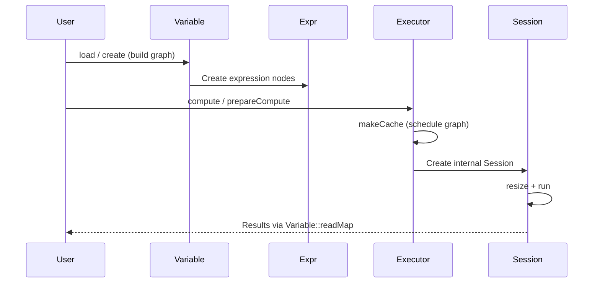

# MNN - Deep Learning Inference Framework

## Overview

MNN is a lightweight, high-performance deep learning inference engine developed by Alibaba Group. It provides a complete runtime for loading, optimizing, and executing neural network models across diverse backends (CPU, GPU, NPU). The framework is designed around a modular architecture that separates model representation, scheduling, memory management, and backend-specific execution.

### Key Capabilities
- **Multi-Backend Support**: CPU (ARM/x86 with SIMD), OpenCL, Vulkan, Metal, CUDA, MUSA, NN-API
- **Model Formats**: MNN's native FlatBuffers-based format, with converters from TensorFlow, Caffe, ONNX, TFLite
- **Memory Optimization**: Deferred and eager allocation strategies with buffer reuse
- **Execution Scheduling**: Pipeline-based scheduling with geometry optimization
- **Control Flow**: Support for If, While, NMS, and Mixture-of-Experts operations
- **Plugin System**: Extensible shape inference and compute kernel registration
- **Quantization**: INT8, FP16, INT4 sparse weight support

---

## Architecture Overview

---

## Module Structure

The MNN framework is organized into the following sub-modules:

| Sub-Module | Description | Documentation |
|---|---|---|
| **Core Runtime** | Backend, Runtime, Execution, and scheduling infrastructure | [Core Runtime](MNN_core_runtime.md) |
| **Expression System** | High-level graph IR, lazy evaluation executor, and module abstraction | [Expression System](MNN_expression_system.md) |
| **Control Flow Modules** | IfModule, WhileModule, NMSModule, MoEModule | [Control Flow Modules](MNN_control_flow.md) |
| **Memory Management** | BufferAllocator, eager/deferred strategies, AutoStorage | [Memory Management](MNN_memory_management.md) |
| **Plugin System** | Plugin context, compute kernel and shape inference registration | [Plugin System](MNN_plugin_system.md) |
| **Utilities** | File I/O, threading, timing, tensor utilities, convolution helpers | [Utilities](MNN_utilities.md) |

---

## Data Flow

### Alternative: Expression API Flow

---

## Key Design Patterns

### 1. Backend Abstraction
All hardware-specific code lives behind the `Backend` and `Runtime` interfaces. `Runtime` factories create `Backend` instances, which in turn create `Execution` objects for individual ops.

### 2. Schedule-Pipeline-Execution Chain
Models flow through: **Schedule** → **Pipeline** → **Execution**:
- `Schedule` partitions the model graph into pipeline stages
- `Pipeline` encodes ops, allocates memory, and orchestrates execution
- `Execution` performs the actual computation

### 3. Lazy Evaluation (Expression System)
The `Expr`/`Variable`/`VARP` system builds a computation graph lazily. `Executor` triggers scheduling and execution only when results are requested via `readMap()`.

### 4. Memory Reuse
`BufferAllocator` with both eager and deferred strategies reuses memory across tensors. Deferred mode defers actual allocation until the total size is known, enabling single-allocation.

---

## Core Data Types

| Type | File | Purpose |
|---|---|---|
| `halide_buffer_t` | HalideRuntime.h | Raw buffer descriptor (host + device pointers, dims, type) |
| `halide_type_t` | HalideRuntime.h | Type descriptor (code, bits, lanes) |
| `Tensor` | Tensor.hpp | Data container wrapping `halide_buffer_t` |
| `Op` / `OpT` | FlatBuffers generated | Operation descriptor |
| `Command` | Command.hpp | Runnable unit: op + tensors + execution |
| `MNNForwardType` | MNNForwardType.h | Backend type enum |
| `BackendConfig` | MNNForwardType.h | Backend configuration (memory, power, precision modes) |

---

## Cross-References

- **[Core Runtime](MNN_core_runtime.md)**: `Backend`, `Runtime`, `Execution`, `Session`, `Schedule`, `Pipeline`, `Tensor`, `Command`
- **[Expression System](MNN_expression_system.md)**: `Expr`, `Variable`, `VARP`, `Executor`, `Module`, `PipelineModule`, `StaticModule`
- **[Control Flow Modules](MNN_control_flow.md)**: `IfModule`, `WhileModule`, `NMSModule`, `MoEModule`
- **[Memory Management](MNN_memory_management.md)**: `BufferAllocator`, `EagerBufferAllocator`, `DeferBufferAllocator`, `AutoStorage`
- **[Plugin System](MNN_plugin_system.md)**: `PluginContext`, `ComputeKernel`, `InferShapeKernel`
- **[Utilities](MNN_utilities.md)**: `FileLoader`, `WorkerThread`, `AutoTime`, `TensorUtils`, `OpCommonUtils`, `ConvolutionCommon`
