# Core Runtime Module Documentation

## Introduction

The Core Runtime module is the backbone of the MNN inference engine. It provides the fundamental abstractions and infrastructure for loading neural network models, partitioning them into executable pipelines, managing tensor memory across heterogeneous hardware backends, and orchestrating inference execution. This module sits at the heart of MNN, bridging the high-level APIs (`Interpreter`, `Module`) with low-level hardware-specific implementations.

The module's responsibilities span:

- **Model Lifecycle**: Loading FlatBuffers-encoded models, validating structure, managing model buffer ownership
- **Runtime Abstraction**: Factory-based creation of backend-specific `Runtime` and `Backend` instances via `RuntimeCreator` registry
- **Scheduling & Partitioning**: Decomposing an `Op` graph into `Pipeline` stages, each bound to a specific `Backend`
- **Execution Orchestration**: Encoding ops, allocating tensor memory, and dispatching `Execution::onExecute`
- **Tensor Management**: Device/host tensor creation, cross-backend memory wrapping, buffer allocation with reuse strategies
- **Concurrency Support**: Background worker threads for async tuning and multi-threaded operation

---

## Architecture

### Component Relationship Diagram

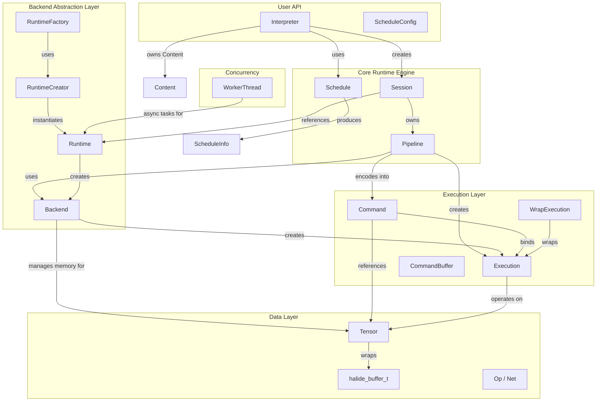
```mermaid
graph TB
    subgraph "User API"
        Interpreter[Interpreter]
        ScheduleConfig[ScheduleConfig]
    end

    subgraph "Core Runtime Engine"
        Schedule[Schedule]
        Session[Session]
        Pipeline[Pipeline]
    end

    subgraph "Backend Abstraction Layer"
        RuntimeFactory[RuntimeFactory]
        Runtime[Runtime]
        Backend[Backend]
        RuntimeCreator[RuntimeCreator]
    end

    subgraph "Execution Layer"
        Execution[Execution]
        WrapExecution[WrapExecution]
        Command[Command]
        CommandBuffer[CommandBuffer]
    end

    subgraph "Data Layer"
        Tensor[Tensor]
        halide_buffer_t[halide_buffer_t]
        Op[Op / Net]
    end

    subgraph "Concurrency"
        WorkerThread[WorkerThread]
    end

    Interpreter -->|"creates"| Session
    Interpreter -->|"uses"| Schedule
    Interpreter -->|"owns Content"| Content[Content]
    Schedule -->|"produces"| ScheduleInfo
    Session -->|"owns"| Pipeline
    Session -->|"references"| Runtime
    Pipeline -->|"encodes into"| Command
    Pipeline -->|"creates"| Execution
    Pipeline -->|"uses"| Backend
    Runtime -->|"creates"| Backend
    RuntimeFactory -->|"uses"| RuntimeCreator
    RuntimeCreator -->|"instantiates"| Runtime
    Backend -->|"creates"| Execution
    Backend -->|"manages memory for"| Tensor
    Command -->|"binds"| Execution
    Command -->|"references"| Tensor
    Execution -->|"operates on"| Tensor
    WrapExecution -->|"wraps"| Execution
    Tensor -->|"wraps"| halide_buffer_t
    WorkerThread -->|"async tasks for"| Runtime
```

### Module Dependency Map

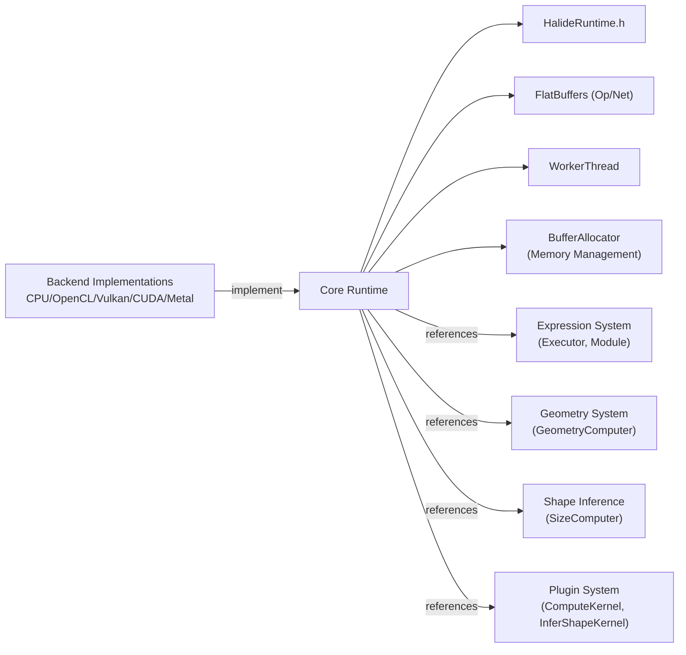
```mermaid
graph LR
    CoreRuntime[Core Runtime] --> Halide[HalideRuntime.h]
    CoreRuntime --> FlatBuffers["FlatBuffers (Op/Net)"]
    CoreRuntime --> WorkerThread[WorkerThread]
    CoreRuntime --> BufferAllocator["BufferAllocator<br/>(Memory Management)"]

    CoreRuntime -->|"references"| ExpressionSystem["Expression System<br/>(Executor, Module)"]
    CoreRuntime -->|"references"| GeometryComputer["Geometry System<br/>(GeometryComputer)"]
    CoreRuntime -->|"references"| SizeComputer["Shape Inference<br/>(SizeComputer)"]
    CoreRuntime -->|"references"| PluginSystem["Plugin System<br/>(ComputeKernel, InferShapeKernel)"]

    BackendImpl[Backend Implementations<br/>CPU/OpenCL/Vulkan/CUDA/Metal] -->|"implement"| CoreRuntime
```

---

## Core Data Structures

### Tensor (`include/MNN/Tensor.hpp`)

`Tensor` is the fundamental data container in MNN. It wraps a `halide_buffer_t` (from Halide) and adds MNN-specific metadata via `InsideDescribe`.

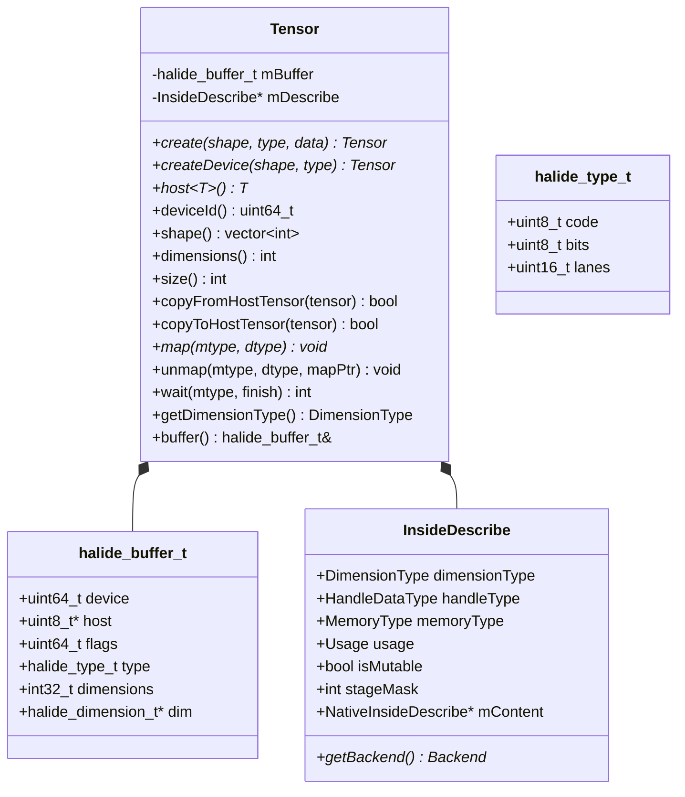
```mermaid
classDiagram
    class Tensor {
        -halide_buffer_t mBuffer
        -InsideDescribe* mDescribe
        +create(shape, type, data) Tensor*
        +createDevice(shape, type) Tensor*
        +host~T~() T*
        +deviceId() uint64_t
        +shape() vector~int~
        +dimensions() int
        +size() int
        +copyFromHostTensor(tensor) bool
        +copyToHostTensor(tensor) bool
        +map(mtype, dtype) void*
        +unmap(mtype, dtype, mapPtr) void
        +wait(mtype, finish) int
        +getDimensionType() DimensionType
        +buffer() halide_buffer_t&
    }

    class halide_buffer_t {
        +uint64_t device
        +uint8_t* host
        +uint64_t flags
        +halide_type_t type
        +int32_t dimensions
        +halide_dimension_t* dim
    }

    class halide_type_t {
        +uint8_t code
        +uint8_t bits
        +uint16_t lanes
    }

    class InsideDescribe {
        +DimensionType dimensionType
        +HandleDataType handleType
        +MemoryType memoryType
        +Usage usage
        +bool isMutable
        +int stageMask
        +NativeInsideDescribe* mContent
        +getBackend() Backend*
    }

    Tensor *-- halide_buffer_t
    Tensor *-- InsideDescribe
```

**Key concepts**:
- **Host vs Device**: `host` points to CPU memory; `device` holds a backend-specific handle (e.g., GPU buffer ID). The same tensor can have both.
- **Dimension Types**: `TENSORFLOW` (NHWC), `CAFFE` (NCHW), `CAFFE_C4` (NC4HW4 packed layout for SIMD).
- **Memory Ownership**: Device tensors are typically created by the engine; host tensors can be created by users.
- **InsideDescribe**: Holds backend pointer, memory type, mutability flags, and staging information used during geometry transformations.

> See also: [Memory Management](MNN_memory_management.md) for `BufferAllocator` integration.

---

### Command & CommandBuffer (`source/core/Command.hpp`)

`Command` represents a single runnable unit: one op bound to its tensors and execution object.

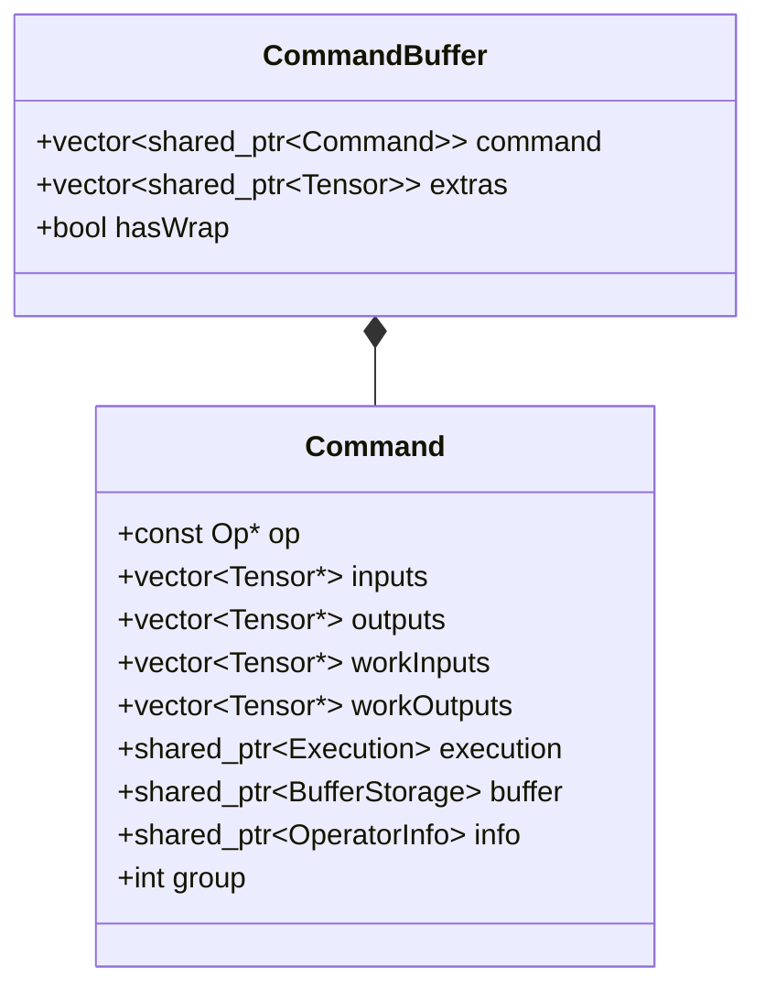
```mermaid
classDiagram
    class Command {
        +const Op* op
        +vector~Tensor*~ inputs
        +vector~Tensor*~ outputs
        +vector~Tensor*~ workInputs
        +vector~Tensor*~ workOutputs
        +shared_ptr~Execution~ execution
        +shared_ptr~BufferStorage~ buffer
        +shared_ptr~OperatorInfo~ info
        +int group
    }

    class CommandBuffer {
        +vector~shared_ptr~Command~~ command
        +vector~shared_ptr~Tensor~~ extras
        +bool hasWrap
    }

    CommandBuffer *-- Command
```

- **`workInputs`/`workOutputs`**: Tensors after geometry transformation (may differ from the original op's inputs/outputs).
- **`inputs`/`outputs`**: The original tensors from the model graph.
- **`buffer`**: Holds the serialized flatbuffers `Op` data.
- **`execution`**: The backend-specific `Execution` object created during `allocMemory`.
- **`hasWrap`**: Indicates whether cross-backend wrapping (`WrapExecution`) is needed.

---

### OperatorInfo (`source/core/Command.hpp`)

Lightweight metadata carrier for operator introspection and debugging:

| Field | Type | Purpose |
|---|---|---|
| `name()` | `const std::string&` | Operator name from model |
| `type()` | `const std::string&` | Operator type string |
| `flops()` | `float` | Floating-point operations (in MFLOPs) |

---

## Backend Abstraction Layer

The backend abstraction is a three-tier hierarchy: **RuntimeCreator** → **Runtime** → **Backend** → **Execution**.

### RuntimeCreator & RuntimeFactory

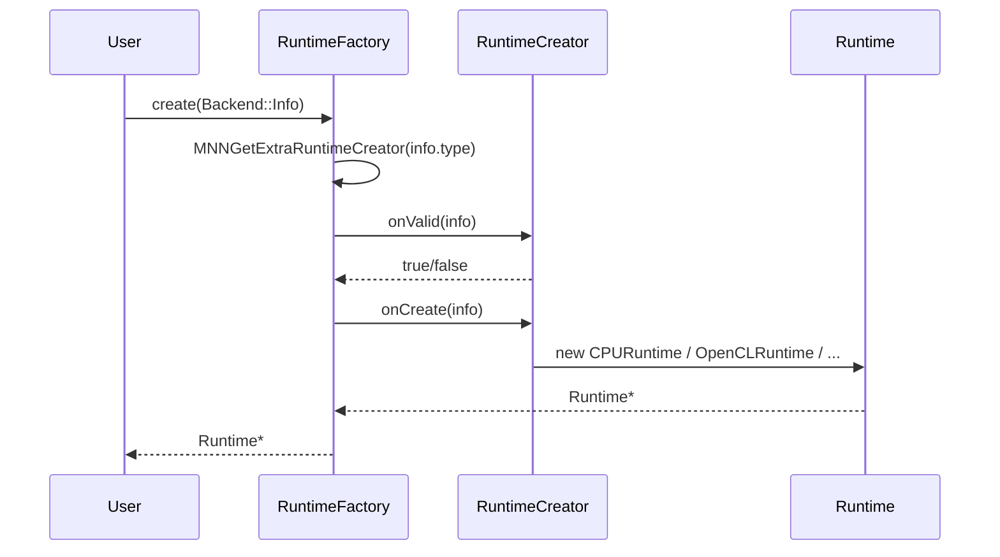
```mermaid
sequenceDiagram
    participant User
    participant RuntimeFactory
    participant RuntimeCreator
    participant Runtime

    User->>RuntimeFactory: create(Backend::Info)
    RuntimeFactory->>RuntimeFactory: MNNGetExtraRuntimeCreator(info.type)
    RuntimeFactory->>RuntimeCreator: onValid(info)
    RuntimeCreator-->>RuntimeFactory: true/false
    RuntimeFactory->>RuntimeCreator: onCreate(info)
    RuntimeCreator->>Runtime: new CPURuntime / OpenCLRuntime / ...
    Runtime-->>RuntimeFactory: Runtime*
    RuntimeFactory-->>User: Runtime*
```

**Registration mechanism**: Backend implementations register themselves at static initialization time via `MNNInsertExtraRuntimeCreator(MNNForwardType type, const RuntimeCreator* creator)`. The `RuntimeFactory` looks up the appropriate creator by forward type.

### Runtime (`source/core/Backend.hpp`)

`Runtime` is the top-level manager for a specific hardware backend type. Each runtime:

- Creates `Backend` instances via `onCreate()`
- Manages global cache via `onSetCache()` / `onGetCache()`
- Controls compilation strategy via `onGetCompilerType()`
- Handles garbage collection and memory measurement
- Provides concurrency hooks (`onConcurrencyBegin/End`)
- Tracks cancellation state (`mCancelled`)
- Stores configuration hints (`RuntimeHint`)

**Compiler Types**:
| Type | Description |
|---|---|
| `Compiler_Geometry` | Default: Decompose ops via geometry transformation |
| `Compiler_Origin` | Use original op directly (for backends that don't support decomposition) |
| `Compiler_Loop` | Use loop-based decomposition |

### Backend (`source/core/Backend.hpp`)

`Backend` is a per-instance handle that manages memory and creates `Execution` objects. Each `Backend` belongs to a `Runtime`.

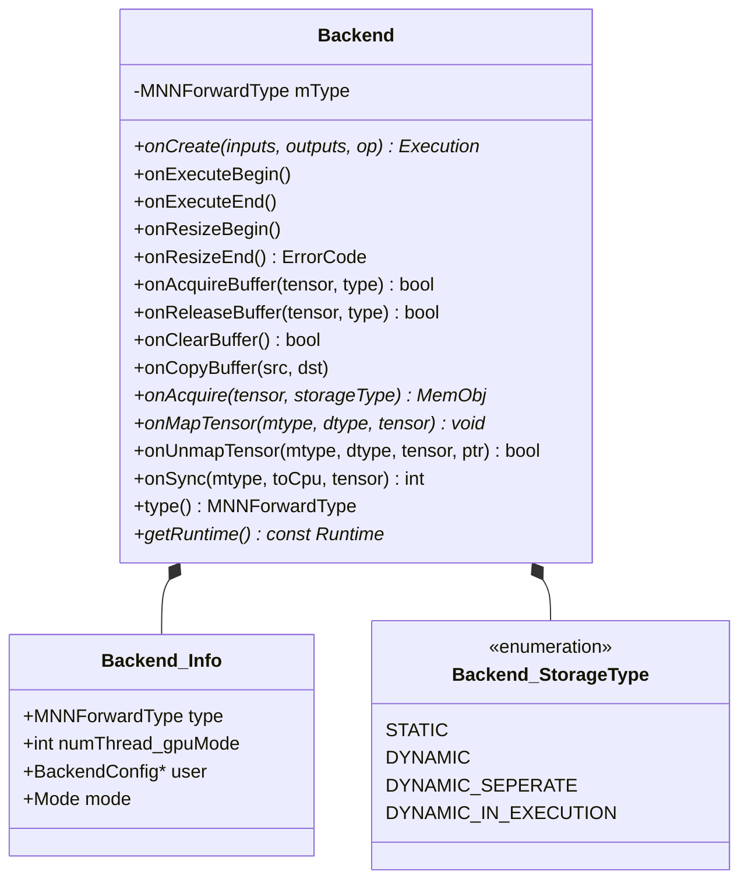
```mermaid
classDiagram
    class Backend {
        -MNNForwardType mType
        +onCreate(inputs, outputs, op) Execution*
        +onExecuteBegin()
        +onExecuteEnd()
        +onResizeBegin()
        +onResizeEnd() ErrorCode
        +onAcquireBuffer(tensor, type) bool
        +onReleaseBuffer(tensor, type) bool
        +onClearBuffer() bool
        +onCopyBuffer(src, dst)
        +onAcquire(tensor, storageType) MemObj*
        +onMapTensor(mtype, dtype, tensor) void*
        +onUnmapTensor(mtype, dtype, tensor, ptr) bool
        +onSync(mtype, toCpu, tensor) int
        +type() MNNForwardType
        +getRuntime() const Runtime*
    }

    class Backend_Info {
        +MNNForwardType type
        +int numThread_gpuMode
        +BackendConfig* user
        +Mode mode
    }

    class Backend_StorageType {
        <<enumeration>>
        STATIC
        DYNAMIC
        DYNAMIC_SEPERATE
        DYNAMIC_IN_EXECUTION
    }

    Backend *-- Backend_Info
    Backend *-- Backend_StorageType
```

**Storage Types**:
| Type | Alloc at `onAcquireBuffer` | Release at `onReleaseBuffer` | Clear at `onClearBuffer` |
|---|---|---|---|
| `STATIC` | Yes | Yes (frees) | No-op |
| `DYNAMIC` | Yes (reuses if possible) | Collects for reuse | Frees all |
| `DYNAMIC_SEPERATE` | Yes | No-op | Frees all |
| `DYNAMIC_IN_EXECUTION` | Special mode | - | - |

**Info::Mode**:
| Mode | Behavior |
|---|---|
| `DIRECT` | `Execution::onExecute` runs immediately |
| `INDIRECT` | Op is recorded; runs on `onExecuteBegin`, waits on `onExecuteEnd` |

### RuntimeHint (`source/core/Backend.hpp`)

Configuration hints passed from the user through `Interpreter::setSessionHint` to the `Runtime`:

| Field | Default | Purpose |
|---|---|---|
| `memoryAllocatorType` | `0` (Defer) | `0` = Deferred, `1` = Eager allocation |
| `winogradMemoryUsed` | `3` | Winograd unit candidate count |
| `cpuDecreaseRate` | `50` | big.LITTLE core capacity ratio (0-100) |
| `dynamicQuantOption` | `0` | Dynamic quantization strategy |
| `attentionOption` | `8` | KV-cache quantization + flash attention flags |
| `kvcacheSizeLimit` | `-1` | Max per-layer KV-cache memory before spilling to disk |
| `kvcacheDirPath` | `""` | Directory for KV-cache files |
| `encorderNumForCommit` | `10` | Op encoder batch size for commit |
| `initThreadNumber` | `0` | Extra threads for module loading |
| `useArmSme2Cores` | `true` | Enable ARM SME2 cores when threads > 1 |
| `divisionRatio` | `41` | SME-to-NEON workload division ratio |
| `smeCores` | `2` | Number of SME cores |

---

## Execution Layer

### Execution (`source/core/Execution.hpp`)

`Execution` is the abstract base for every op implementation. Each op type on each backend has a concrete `Execution` subclass.

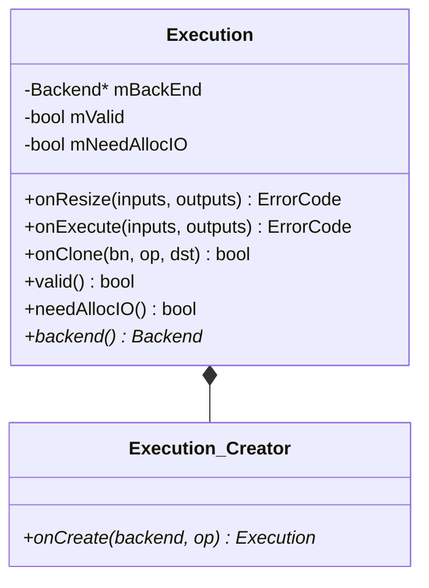
```mermaid
classDiagram
    class Execution {
        -Backend* mBackEnd
        -bool mValid
        -bool mNeedAllocIO
        +onResize(inputs, outputs) ErrorCode
        +onExecute(inputs, outputs) ErrorCode
        +onClone(bn, op, dst) bool
        +valid() bool
        +needAllocIO() bool
        +backend() Backend*
    }

    class Execution_Creator {
        +onCreate(backend, op) Execution*
    }

    Execution *-- Execution_Creator
```

**Lifecycle**:
1. `Backend::onCreate()` instantiates an `Execution` for a given `Op`
2. `onResize()` is called when input/output shapes change — allocates internal buffers
3. `onExecute()` performs the actual computation
4. `onClone()` optionally creates a copy sharing weights (for multi-threading)

**Plugin Registration**: Custom ops can register `Execution::Creator` instances via `insertExtraCreator(key, type, creator)` and query them via `searchExtraCreator(key, type)`.

> See also: [Plugin System](MNN_plugin_system.md) for `ComputeKernel` and `InferShapeKernel`.

### WrapExecution (`source/core/WrapExecution.hpp`)

`WrapExecution` handles cross-backend tensor conversion transparently. When the scheduler places ops on different backends, `WrapExecution` inserts copy operations.

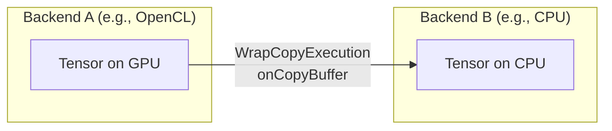
```mermaid
flowchart LR
    subgraph "Backend A (e.g., OpenCL)"
        TensorA[Tensor on GPU]
    end
    subgraph "Backend B (e.g., CPU)"
        TensorB[Tensor on CPU]
    end

    TensorA -->|"WrapCopyExecution<br/>onCopyBuffer"| TensorB
```

**Key methods**:
| Method | Purpose |
|---|---|
| `needWrap(input, current)` | Check if tensor needs wrapping for target backend |
| `allocAndCopy(curBackend, input, output)` | Allocate and copy tensor to new backend |
| `copyConstCache(tensor, curBackend, cache, forbid)` | Copy const tensor to target backend, with caching |
| `makeCopyExecution(backend, backup)` | Create a `WrapCopyExecution` for cross-backend copy |
| `copyReplaceTensor(wrapTensor, tensor)` | Replace tensor's internal descriptor (in-place conversion) |

---

## Scheduling & Orchestration

### Overview

The scheduling pipeline transforms a raw model (`Net`) into executable pipelines:

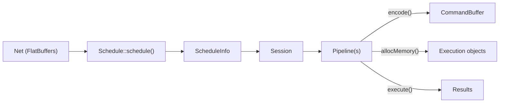
```mermaid
flowchart LR
    Net["Net (FlatBuffers)"] --> Schedule["Schedule::schedule()"]
    Schedule --> ScheduleInfo["ScheduleInfo"]
    ScheduleInfo --> Session["Session"]
    Session --> Pipeline["Pipeline(s)"]
    Pipeline -->|"encode()"| CommandBuffer["CommandBuffer"]
    Pipeline -->|"allocMemory()"| Execution["Execution objects"]
    Pipeline -->|"execute()"| Results["Results"]
```

### Schedule (`source/core/Schedule.hpp`)

`Schedule` is a static utility class that partitions a model into pipeline stages.

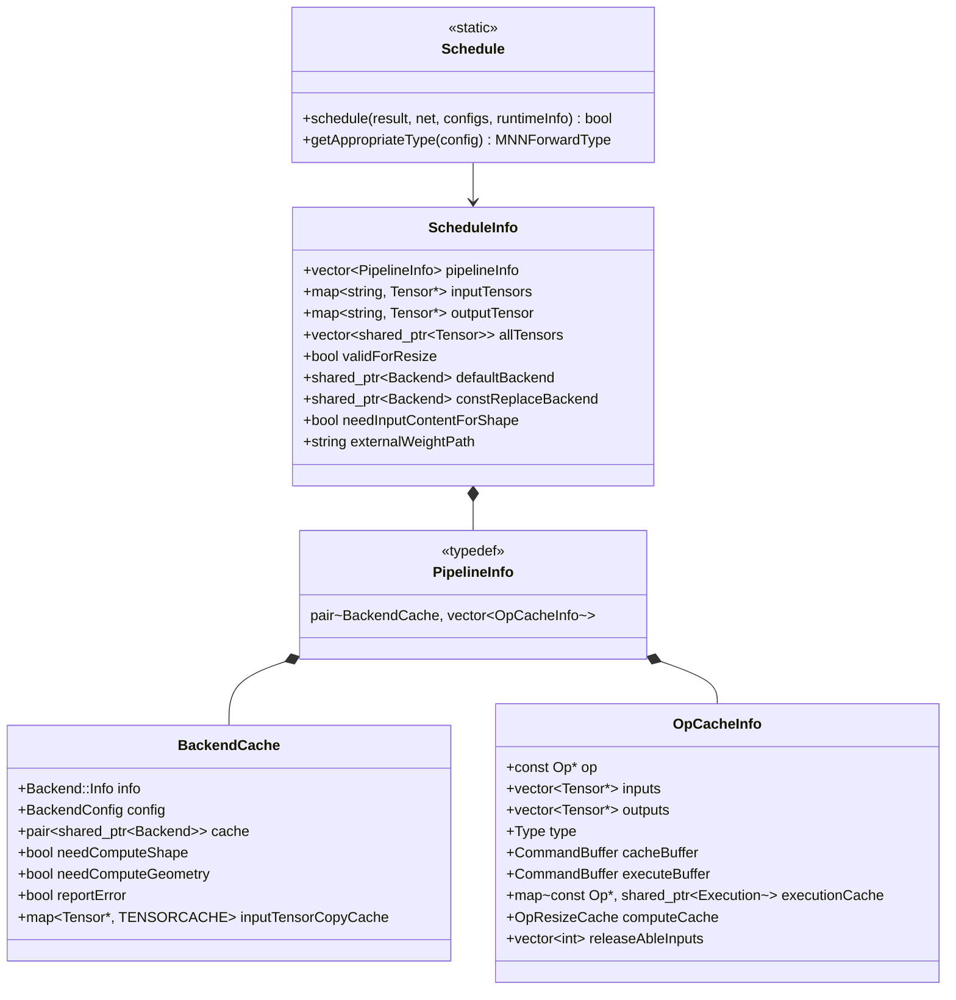
```mermaid
classDiagram
    class Schedule {
        <<static>>
        +schedule(result, net, configs, runtimeInfo) bool
        +getAppropriateType(config) MNNForwardType
    }

    class ScheduleInfo {
        +vector~PipelineInfo~ pipelineInfo
        +map~string, Tensor*~ inputTensors
        +map~string, Tensor*~ outputTensor
        +vector~shared_ptr~Tensor~~ allTensors
        +bool validForResize
        +shared_ptr~Backend~ defaultBackend
        +shared_ptr~Backend~ constReplaceBackend
        +bool needInputContentForShape
        +string externalWeightPath
    }

    class OpCacheInfo {
        +const Op* op
        +vector~Tensor*~ inputs
        +vector~Tensor*~ outputs
        +Type type
        +CommandBuffer cacheBuffer
        +CommandBuffer executeBuffer
        +map~const Op*, shared_ptr~Execution~~ executionCache
        +OpResizeCache computeCache
        +vector~int~ releaseAbleInputs
    }

    class PipelineInfo {
        <<typedef>>
        pair~BackendCache, vector~OpCacheInfo~~
    }

    class BackendCache {
        +Backend::Info info
        +BackendConfig config
        +pair~shared_ptr~Backend~~ cache
        +bool needComputeShape
        +bool needComputeGeometry
        +bool reportError
        +map~Tensor*, TENSORCACHE~ inputTensorCopyCache
    }

    Schedule --> ScheduleInfo
    ScheduleInfo *-- PipelineInfo
    PipelineInfo *-- BackendCache
    PipelineInfo *-- OpCacheInfo
```

**Op Schedule Types**:
| Type | Description |
|---|---|
| `SEPARATE` | Shape can be computed independently |
| `CONSTANT` | Shape and content are fixed; can release inputs after resize |
| `NOT_SEPERATE` | Shape computation depends on runtime data |

**ScheduleConfig** (from `Interpreter.hpp`) drives scheduling decisions:
- `path`: Defines which subgraph to run (by op names or tensor names)
- `type` / `backupType`: Primary and fallback backend types
- `numThread`: Thread count for CPU or GPU mode
- `backendConfig`: Memory/power/precision preferences

### Pipeline (`source/core/Pipeline.hpp`)

`Pipeline` is the workhorse that encodes, allocates, and executes a sequence of ops.

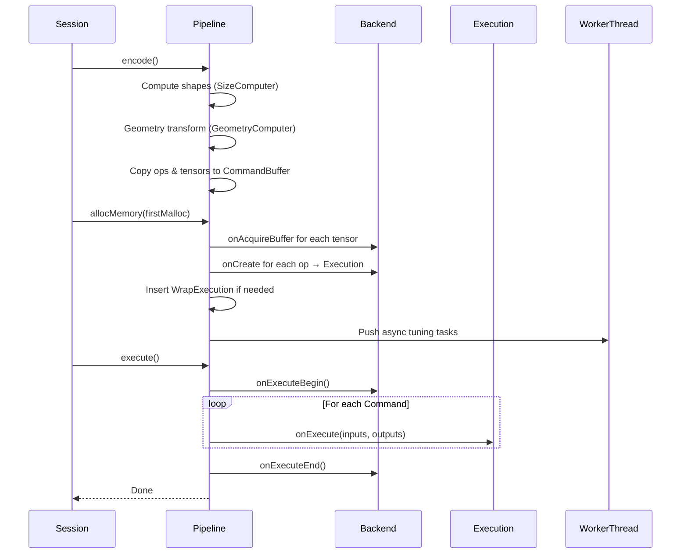
```mermaid
sequenceDiagram
    participant Session
    participant Pipeline
    participant Backend
    participant Execution
    participant WorkerThread

    Session->>Pipeline: encode()
    Pipeline->>Pipeline: Compute shapes (SizeComputer)
    Pipeline->>Pipeline: Geometry transform (GeometryComputer)
    Pipeline->>Pipeline: Copy ops & tensors to CommandBuffer

    Session->>Pipeline: allocMemory(firstMalloc)
    Pipeline->>Backend: onAcquireBuffer for each tensor
    Pipeline->>Backend: onCreate for each op → Execution
    Pipeline->>Pipeline: Insert WrapExecution if needed
    Pipeline->>WorkerThread: Push async tuning tasks

    Session->>Pipeline: execute()
    Pipeline->>Backend: onExecuteBegin()
    loop For each Command
        Pipeline->>Execution: onExecute(inputs, outputs)
    end
    Pipeline->>Backend: onExecuteEnd()
    Pipeline-->>Session: Done
```

**Pipeline state machine**:

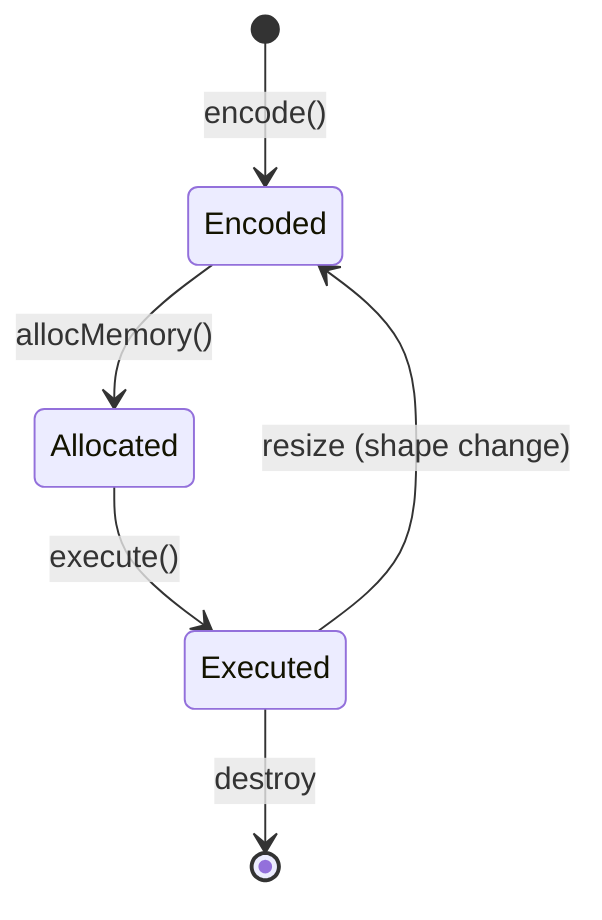
```mermaid
stateDiagram-v2
    [*] --> Encoded: encode()
    Encoded --> Allocated: allocMemory()
    Allocated --> Executed: execute()
    Executed --> Encoded: resize (shape change)
    Executed --> [*]: destroy
```

**Key members**:
| Member | Purpose |
|---|---|
| `mInfo` (`PipelineInfo`) | The schedule data for this pipeline |
| `mAllocInput` | Whether to allocate input tensors inside the pipeline |
| `mOutputStatic` | Whether output tensors are statically allocated |
| `mTuneAttr` | Auto-tuning configuration |
| `mCacheConstTensors` | Cache of constant tensors copied to this backend |
| `mWrapTensors` | Map of wrapped tensors for cross-backend ops |
| `mContext` (`GeometryComputer::Context`) | Geometry transformation state |
| `mRuntime` / `mCpuRuntime` | Pointers to main and CPU runtimes |

**TuningAttr**:
| Field | Purpose |
|---|---|
| `autoSetOpType` | Automatically select best op implementation |
| `maxTuningNumber` | Max number of ops to tune in parallel |

### Session (`source/core/Session.hpp`)

`Session` is the user-facing inference unit. It owns one or more `Pipeline` instances and orchestrates their execution.

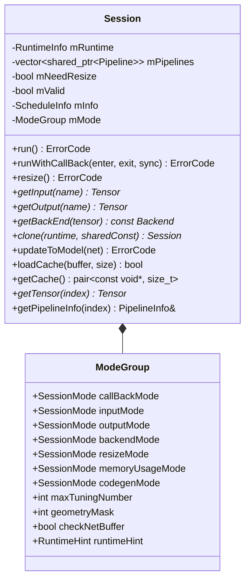
```mermaid
classDiagram
    class Session {
        -RuntimeInfo mRuntime
        -vector~shared_ptr~Pipeline~~ mPipelines
        -bool mNeedResize
        -bool mValid
        -ScheduleInfo mInfo
        -ModeGroup mMode
        +run() ErrorCode
        +runWithCallBack(enter, exit, sync) ErrorCode
        +resize() ErrorCode
        +getInput(name) Tensor*
        +getOutput(name) Tensor*
        +getBackEnd(tensor) const Backend*
        +clone(runtime, sharedConst) Session*
        +updateToModel(net) ErrorCode
        +loadCache(buffer, size) bool
        +getCache() pair~const void*, size_t~
        +getTensor(index) Tensor*
        +getPipelineInfo(index) PipelineInfo&
    }

    class ModeGroup {
        +SessionMode callBackMode
        +SessionMode inputMode
        +SessionMode outputMode
        +SessionMode backendMode
        +SessionMode resizeMode
        +SessionMode memoryUsageMode
        +SessionMode codegenMode
        +int maxTuningNumber
        +int geometryMask
        +bool checkNetBuffer
        +RuntimeHint runtimeHint
    }

    Session *-- ModeGroup
```

**SessionMode flags** control every aspect of session behavior:

| Category | Mode | Description |
|---|---|---|
| **Callback** | `Session_Debug` | Callbacks enabled, op info accessible |
| | `Session_Release` | Callbacks disabled for performance |
| **Input** | `Session_Input_Inside` | Session allocates input tensors |
| | `Session_Input_User` | User provides input tensors |
| **Output** | `Session_Output_Inside` | Output tensors owned by session |
| | `Session_Output_User` | Output tensors separable from session |
| **Resize** | `Session_Resize_Direct` | Resize immediately on session creation |
| | `Session_Resize_Defer` | Defer resize to first `resizeSession()` call |
| **Backend** | `Session_Backend_Fix` | Use user-specified backend strictly |
| | `Session_Backend_Auto` | Auto-select backend per op |
| **Memory** | `Session_Memory_Collect` | Recycle static memory on resize |
| | `Session_Memory_Cache` | Cache static memory for reuse |
| **Codegen** | `Session_Codegen_Disable` | Disable code generation |
| | `Session_Codegen_Enable` | Enable JIT code generation |
| **Resize Opt** | `Session_Resize_Check` | Trace resize patterns |
| | `Session_Resize_Fix` | Apply resize optimizations |

---

## Interpreter & API Layer

### Interpreter (`include/MNN/Interpreter.hpp`, `source/core/Interpreter.cpp`)

`Interpreter` is the primary user-facing API. It manages the model buffer and all created sessions.

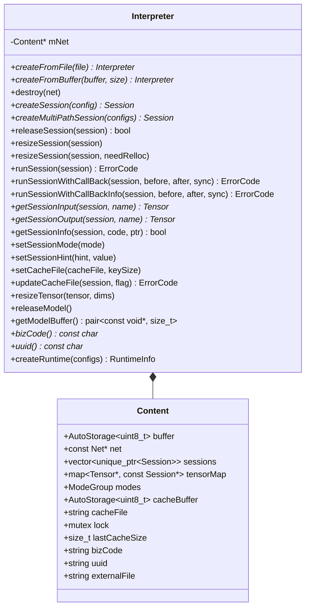
```mermaid
classDiagram
    class Interpreter {
        -Content* mNet
        +createFromFile(file) Interpreter*
        +createFromBuffer(buffer, size) Interpreter*
        +destroy(net)
        +createSession(config) Session*
        +createMultiPathSession(configs) Session*
        +releaseSession(session) bool
        +resizeSession(session)
        +resizeSession(session, needRelloc)
        +runSession(session) ErrorCode
        +runSessionWithCallBack(session, before, after, sync) ErrorCode
        +runSessionWithCallBackInfo(session, before, after, sync) ErrorCode
        +getSessionInput(session, name) Tensor*
        +getSessionOutput(session, name) Tensor*
        +getSessionInfo(session, code, ptr) bool
        +setSessionMode(mode)
        +setSessionHint(hint, value)
        +setCacheFile(cacheFile, keySize)
        +updateCacheFile(session, flag) ErrorCode
        +resizeTensor(tensor, dims)
        +releaseModel()
        +getModelBuffer() pair~const void*, size_t~
        +bizCode() const char*
        +uuid() const char*
        +createRuntime(configs) RuntimeInfo
    }

    class Content {
        +AutoStorage~uint8_t~ buffer
        +const Net* net
        +vector~unique_ptr~Session~~ sessions
        +map~Tensor*, const Session*~ tensorMap
        +ModeGroup modes
        +AutoStorage~uint8_t~ cacheBuffer
        +string cacheFile
        +mutex lock
        +size_t lastCacheSize
        +string bizCode
        +string uuid
        +string externalFile
    }

    Interpreter *-- Content
```

**Thread Safety**: `Interpreter` uses `std::mutex` (`mNet->lock`) to serialize all session creation, destruction, and tensor operations. The mutex is acquired in `std::unique_lock` scope for each public method.

**Model Lifecycle**:
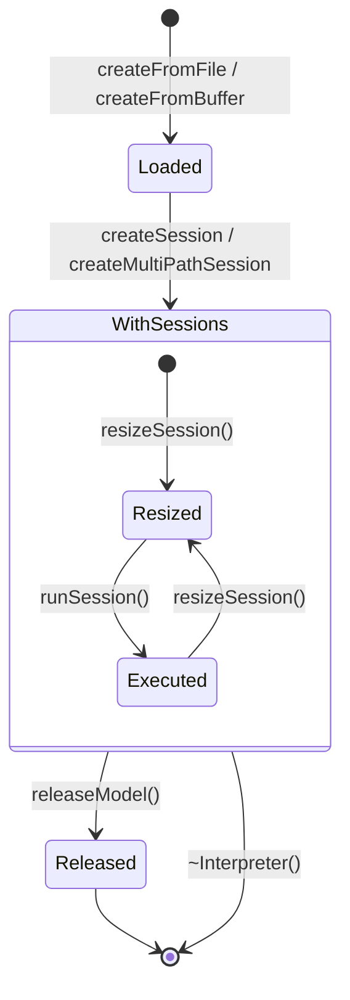
```mermaid
stateDiagram-v2
    [*] --> Loaded: createFromFile / createFromBuffer
    Loaded --> WithSessions: createSession / createMultiPathSession
    WithSessions --> Released: releaseModel()
    Released --> [*]
    WithSessions --> [*]: ~Interpreter()

    state WithSessions {
        [*] --> Resized: resizeSession()
        Resized --> Executed: runSession()
        Executed --> Resized: resizeSession()
    }
```

**Cache Management**:
1. `setCacheFile(path)` loads existing cache into `Content::cacheBuffer`
2. On session creation, the cache is loaded into runtimes via `Runtime::onSetCache()`
3. After session creation, if no cache existed, a new cache is written via `Runtime::onGetCache()`
4. `updateCacheFile(session)` writes updated cache after resize

---

## Concurrency & Async Support

### WorkerThread (`source/core/WorkerThread.hpp`)

A singleton thread pool used for async operations like auto-tuning and module loading.

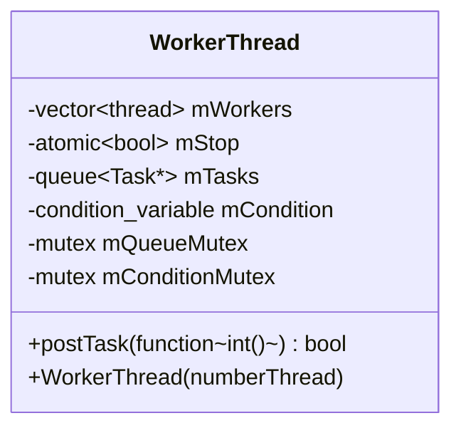
```mermaid
classDiagram
    class WorkerThread {
        -vector~thread~ mWorkers
        -atomic~bool~ mStop
        -queue~Task*~ mTasks
        -condition_variable mCondition
        -mutex mQueueMutex
        -mutex mConditionMutex
        +postTask(function~int()~) bool
        +WorkerThread(numberThread)
    }
```

**Usage pattern**: `Runtime::setAsyncWork(std::future<int>&&)` stores a future; `Runtime::hasAsyncWork()` and `Runtime::waitAsyncWork()` poll/block on it. This is used by `Session` to coordinate async resize/tuning operations.

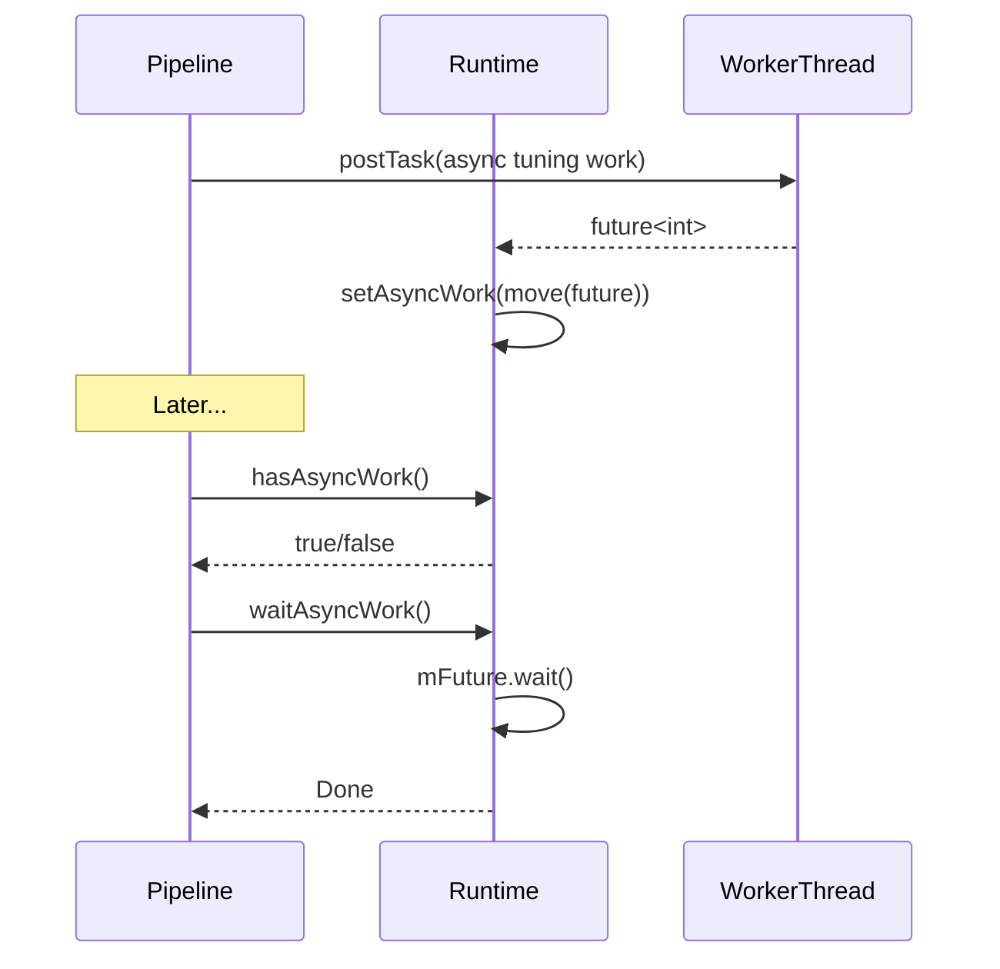
```mermaid
sequenceDiagram
    participant Pipeline
    participant Runtime
    participant WorkerThread

    Pipeline->>WorkerThread: postTask(async tuning work)
    WorkerThread-->>Runtime: future<int>
    Runtime->>Runtime: setAsyncWork(move(future))
    
    Note over Pipeline: Later...
    Pipeline->>Runtime: hasAsyncWork()
    Runtime-->>Pipeline: true/false
    Pipeline->>Runtime: waitAsyncWork()
    Runtime->>Runtime: mFuture.wait()
    Runtime-->>Pipeline: Done
```

---

## Session Creation & Execution Flow

### Complete Sequence

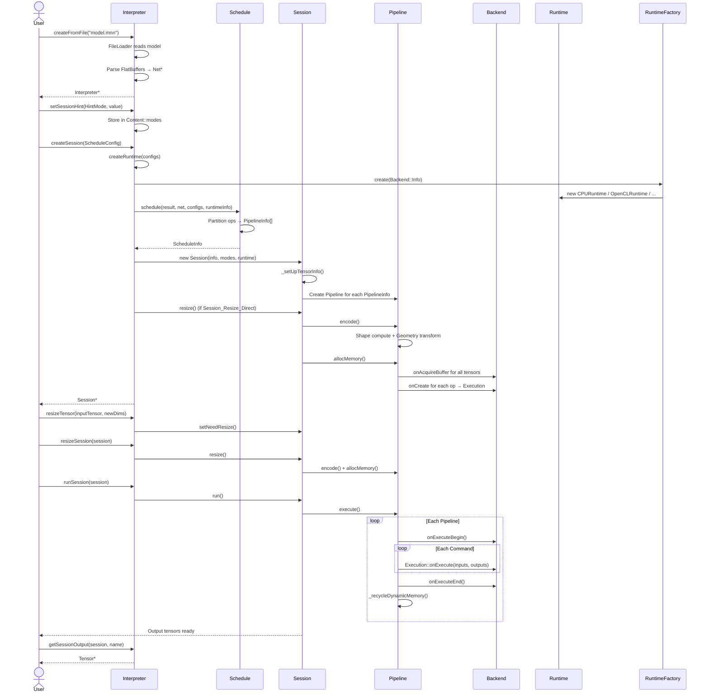
```mermaid
sequenceDiagram
    actor User
    participant Interpreter
    participant Schedule
    participant Session
    participant Pipeline
    participant Backend
    participant Runtime

    %% Model Loading
    User->>Interpreter: createFromFile("model.mnn")
    Interpreter->>Interpreter: FileLoader reads model
    Interpreter->>Interpreter: Parse FlatBuffers → Net*
    Interpreter-->>User: Interpreter*

    %% Configuration
    User->>Interpreter: setSessionHint(HintMode, value)
    Interpreter->>Interpreter: Store in Content::modes

    %% Session Creation
    User->>Interpreter: createSession(ScheduleConfig)
    Interpreter->>Interpreter: createRuntime(configs)
    Interpreter->>RuntimeFactory: create(Backend::Info)
    RuntimeFactory->>Runtime: new CPURuntime / OpenCLRuntime / ...
    Interpreter->>Schedule: schedule(result, net, configs, runtimeInfo)
    Schedule->>Schedule: Partition ops → PipelineInfo[]
    Schedule-->>Interpreter: ScheduleInfo
    Interpreter->>Session: new Session(info, modes, runtime)
    Session->>Session: _setUpTensorInfo()
    Session->>Pipeline: Create Pipeline for each PipelineInfo
    Interpreter->>Session: resize() (if Session_Resize_Direct)
    Session->>Pipeline: encode()
    Pipeline->>Pipeline: Shape compute + Geometry transform
    Session->>Pipeline: allocMemory()
    Pipeline->>Backend: onAcquireBuffer for all tensors
    Pipeline->>Backend: onCreate for each op → Execution
    Interpreter-->>User: Session*

    %% Execution
    User->>Interpreter: resizeTensor(inputTensor, newDims)
    Interpreter->>Session: setNeedResize()

    User->>Interpreter: resizeSession(session)
    Interpreter->>Session: resize()
    Session->>Pipeline: encode() + allocMemory()

    User->>Interpreter: runSession(session)
    Interpreter->>Session: run()
    Session->>Pipeline: execute()
    loop Each Pipeline
        Pipeline->>Backend: onExecuteBegin()
        loop Each Command
            Pipeline->>Backend: Execution::onExecute(inputs, outputs)
        end
        Pipeline->>Backend: onExecuteEnd()
        Pipeline->>Pipeline: _recycleDynamicMemory()
    end
    Session-->>User: Output tensors ready

    User->>Interpreter: getSessionOutput(session, name)
    Interpreter-->>User: Tensor*
```

---

## Cross-Backend Data Flow

When ops in a pipeline span different backends, `WrapCopyExecution` transparently handles data movement:

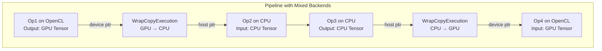
```mermaid
flowchart TB
    subgraph "Pipeline with Mixed Backends"
        A["Op1 on OpenCL<br/>Output: GPU Tensor"]
        B["WrapCopyExecution<br/>GPU → CPU"]
        C["Op2 on CPU<br/>Input: CPU Tensor"]
        D["Op3 on CPU<br/>Output: CPU Tensor"]
        E["WrapCopyExecution<br/>CPU → GPU"]
        F["Op4 on OpenCL<br/>Input: GPU Tensor"]
    end

    A -->|"device ptr"| B
    B -->|"host ptr"| C
    C --> D
    D -->|"host ptr"| E
    E -->|"device ptr"| F
```

The decision to insert a `WrapCopyExecution` is made in `Pipeline::allocMemory()` based on `WrapExecution::needWrap()`:
1. Check if source and destination backends differ
2. If both are CPU variants, check if packing (NC4HW4 layout) differs
3. If wrap is needed, create a `WrapCopyExecution` that copies via a CPU intermediate buffer if both sides are non-CPU

---

## Memory Management Integration

The Core Runtime module defines memory allocation abstractions that integrate with the [Memory Management](MNN_memory_management.md) module:

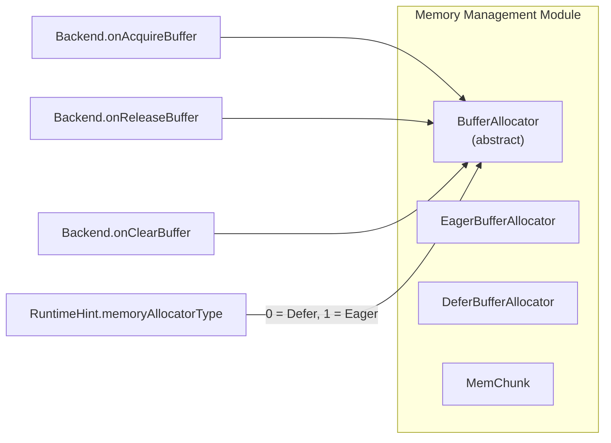
```mermaid
flowchart LR
    Backend.onAcquireBuffer --> BufferAllocator
    Backend.onReleaseBuffer --> BufferAllocator
    Backend.onClearBuffer --> BufferAllocator
    
    subgraph "Memory Management Module"
        BufferAllocator["BufferAllocator<br/>(abstract)"]
        EagerAllocator["EagerBufferAllocator"]
        DeferAllocator["DeferBufferAllocator"]
        MemChunk["MemChunk"]
    end

    RuntimeHint.memoryAllocatorType -->|"0 = Defer, 1 = Eager"| BufferAllocator
```

The `RuntimeHint::memoryAllocatorType` field selects between eager and deferred allocation strategies:
- **Deferred (0)**: Accumulates allocation requests, then allocates a single large block
- **Eager (1)**: Allocates immediately on each request

---

## Key Design Patterns

### 1. Factory + Registry Pattern (Runtime/Execution Creation)

Both `Runtime` and `Execution` use a factory-registry pattern. Backends register creators at static initialization:

```cpp
// Runtime registration (e.g., in CPURuntime.cpp)
extern bool MNNInsertExtraRuntimeCreator(MNN_FORWARD_CPU, new CPURuntimeCreator);

// Execution registration (e.g., for a custom op)
Execution::insertExtraCreator(
    std::shared_ptr<Execution::Creator>(new MyOpCreator),
    "MyOp", MNN_FORWARD_CPU
);
```

### 2. Strategy Pattern (Memory Allocation)

`Backend::StorageType` (STATIC, DYNAMIC, DYNAMIC_SEPERATE) determines the memory reuse strategy, allowing backends to optimize for their specific memory model.

### 3. Template Method Pattern (Pipeline Lifecycle)

`Pipeline` defines the skeleton: `encode()` → `allocMemory()` → `execute()`. Each step delegates to backend-specific implementations via `Backend` and `Execution` virtual methods.

### 4. Observer Pattern (Callbacks)

`Session::runWithCallBack()` allows users to observe and potentially skip ops during execution via `TensorCallBack` / `TensorCallBackWithInfo` function objects.

### 5. Immutable Model + Mutable Session

The model buffer (`Net*`) is treated as immutable and shared across sessions. Each `Session` maintains its own tensor memory and execution state. `Interpreter::releaseModel()` can free the model buffer to save memory once all sessions are created.

---

## Error Handling

All public-facing operations return `ErrorCode`:

| Code | Meaning |
|---|---|
| `NO_ERROR` | Success |
| `OUT_OF_MEMORY` | Memory allocation failure |
| `NOT_SUPPORT` | Operation not supported by backend |
| `INPUT_DATA_ERROR` | Invalid input data |
| `CALL_BACK_STOP` | Callback requested execution stop |

Backend validation failures during scheduling are reported via `BackendCache::reportError`. When `reportError` is true, the backend that failed to create an `Execution` will log an error; when false (used for backup backends), failures are silently ignored.

---

## Thread Safety

| Component | Thread Safety Mechanism |
|---|---|
| `Interpreter` | `std::mutex` in `Content::lock` — all public methods acquire `std::unique_lock` |
| `Session` | Designed for single-threaded use; `clone()` creates independent copies |
| `Runtime` | `mCancelled` (atomic) for cancellation; `mFuture` for async work tracking |
| `WorkerThread` | Mutex-protected task queue with condition variable |

---

## Extension Points

### Adding a New Backend

1. Implement `Runtime` subclass with `onCreate()`, `onGabageCollect()`
2. Implement `RuntimeCreator` subclass
3. Register via `MNNInsertExtraRuntimeCreator(type, creator)`
4. Implement `Backend` subclass with memory management
5. Implement `Execution` subclasses for each supported op

### Adding a Custom Op

1. Implement `Execution::Creator` that creates your `Execution` subclass
2. Register via `Execution::insertExtraCreator(creator, "OpName", type)`
3. Optionally register a shape inference kernel via the [Plugin System](MNN_plugin_system.md)

---

## File Index

| File | Key Components | Purpose |
|---|---|---|
| `include/MNN/Interpreter.hpp` | `Interpreter`, `ScheduleConfig`, `SessionMode` | Public API for model loading and execution |
| `source/core/Interpreter.cpp` | `Content`, model loading/session creation logic | Interpreter implementation |
| `source/core/Backend.hpp` | `Backend`, `Runtime`, `RuntimeCreator`, `RuntimeHint` | Backend abstraction layer |
| `source/core/Execution.hpp` | `Execution`, `Execution::Creator` | Execution abstraction |
| `source/core/Session.hpp` | `Session`, `ModeGroup` | Inference session |
| `source/core/Schedule.hpp` | `Schedule`, `ScheduleInfo`, `OpCacheInfo`, `BackendCache` | Model scheduling and partitioning |
| `source/core/Pipeline.hpp` | `Pipeline`, `UnitInfo`, `TuningAttr` | Pipeline encoding and execution |
| `include/MNN/Tensor.hpp` | `Tensor`, `InsideDescribe` | Core data container |
| `source/core/Command.hpp` | `Command`, `CommandBuffer` | Runnable command structure |
| `source/core/WrapExecution.hpp` | `WrapExecution` | Cross-backend tensor conversion |
| `source/core/WrapExecution.cpp` | `WrapCopyExecution` | Copy execution implementation |
| `source/core/RuntimeFactory.hpp` | `RuntimeFactory` | Runtime factory |
| `source/core/WorkerThread.hpp` | `WorkerThread` | Background thread pool |
| `source/core/NonCopyable.hpp` | `NonCopyable` | Mixin to prevent copying |
| `include/MNN/MNNForwardType.h` | `MNNForwardType`, `BackendConfig`, `MNNGpuMode` | Backend type definitions |
| `include/MNN/HalideRuntime.h` | `halide_buffer_t`, `halide_type_t` | Raw buffer and type descriptors |

---

## Cross-References

- **[MNN Overview](MNN.md)**: Top-level architecture and module structure
- **[Expression System](MNN_expression_system.md)**: `Executor`, `Module`, `Expr` — higher-level graph API built on Core Runtime
- **[Control Flow Modules](MNN_control_flow.md)**: `IfModule`, `WhileModule` — control flow implemented via Core Runtime primitives
- **[Memory Management](MNN_memory_management.md)**: `BufferAllocator`, `EagerBufferAllocator`, `DeferBufferAllocator` — memory allocation strategies
- **[Plugin System](MNN_plugin_system.md)**: `ComputeKernel`, `InferShapeKernel` — extensible op registration
- **[Utilities](MNN_utilities.md)**: `FileLoader`, `TensorUtils`, `OpCommonUtils` — supporting utilities
